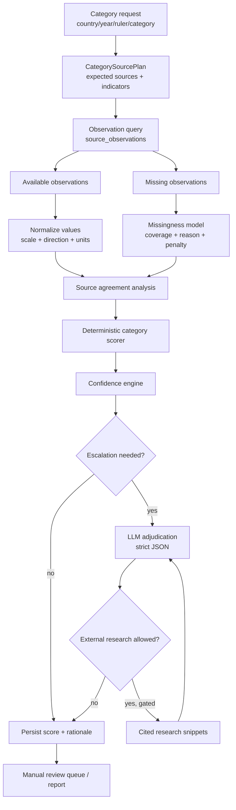
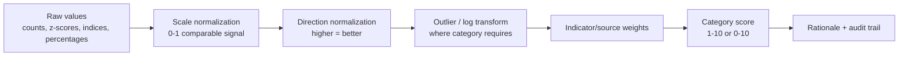
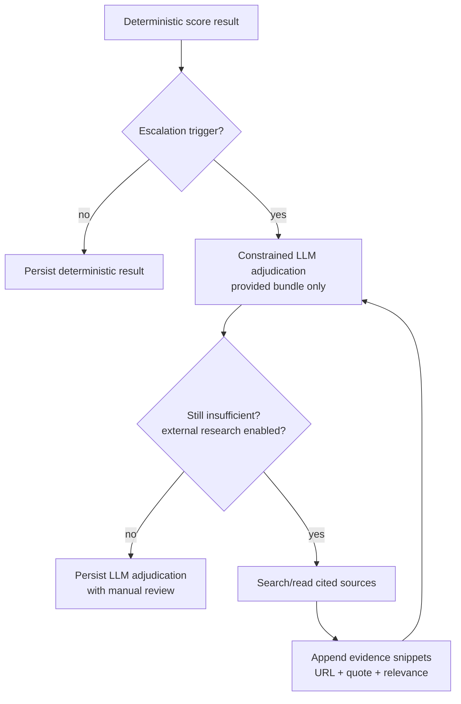

# Architecture — Leaders Database Prototype

This document defines the system design. The authoritative product brief is
[`../requirements/top-level-requirements.md`](../requirements/top-level-requirements.md); section numbers below
reference that document.

## Purpose

`leaders-db` is a local-first Python research prototype that builds an auditable,
confidence-scored database of political leaders and category ratings. It is
designed to reproduce, challenge, explain, and validate the customer's existing
2023 matrix against independent external evidence.

The customer/client matrix is a **validation/test reference only**. It is not
ground truth, not an evidence source, and never contributes to source agreement,
source authority, factual claims, leader identity, or category scoring.

## Scope

**In scope (§2):** one target year at a time, initially 2023; countries above the
client's population threshold; actual ruler or dominant ruling figure per
country-year; external indicators per scoring category; evidence-bundle based
provisional category scores; confidence scores; client-matrix comparison;
manual-review queue; source provenance; reproducible local data lake.

**Out of scope for first prototype:** production webapp, multilingual UI, years
before 1900, and unconstrained online LLM browsing as a default scoring path.
LLM-assisted research may be added as an explicitly gated escalation path only
after structured-data and constrained-adjudication paths are testable.

The future source-ingestion architecture is now tracked separately in
[`sources.md`](sources.md). That document defines the
new `leaders_db.sources` subsystem that will replace prototype source ingestion
over time while keeping existing capabilities available as legacy/reference code.

---

## Architectural Principle: Ratings Are Evidence Bundles

A category rating is **not** produced from one raw number. The production target
is:

```text
country + year + ruler + category
    -> expected source set
    -> available observations
    -> missing observations
    -> normalized comparable signals
    -> deterministic score proposal
    -> confidence + disagreement analysis
    -> optional LLM adjudication/research escalation
    -> system_proposed_score + rationale + review status
```

Every generated score must be explainable as:

1. Which sources were expected for this category?
2. Which source files/API endpoints were actually used?
3. Which raw rows/cells/columns produced each indicator value?
4. Which expected indicators were missing and why?
5. How were raw values normalized and direction-adjusted?
6. How were normalized indicators combined into the proposed 1-10 score?
7. How much did sources agree or conflict?
8. Was the data direct-year, proxy-year, stale, or unavailable?
9. Was an LLM used? If yes, what evidence was it given, what did it return, and
   did it perform gated external research?
10. Why is human review required or not required?

The current `vertical_slice_2023` is only a thin proof of DB/output plumbing. It
uses single-source formulas for `social_wellbeing` and `integrity`; this document
defines the intended main pipeline that replaces those provisional formulas.

---

## High-Level Pipeline

```mermaid
flowchart LR
    subgraph inputs[Inputs]
        Client["Client/customer 2023 matrix\nvalidation reference only"]
        RawSources["Structured external datasets\nV-Dem, WDI/WGI, UCDP, SIPRI, PTS, ..."]
        OptionalWeb["Optional external research\nLLM escalation only"]
    end

    subgraph lake[Local Data Lake]
        Raw["data/raw/<source>/\nimmutable files + metadata.json"]
        Processed["data/processed/<source>/\nnormalized parquet/csv"]
        Outputs["data/outputs/\nreports, review queues"]
    end

    subgraph db[(SQLite / PostgreSQL)]
        Sources["sources"]
        Observations["source_observations"]
        RulerYears["ruler_years"]
        Scores["ruler_scores"]
        Validation["validation_results"]
    end

    subgraph stages[Stages 0-15]
        S0["Stage 0\nsource availability"]
        S1["Stage 1\nclient reference loader"]
        S2["Stage 2\nsource adapters"]
        S3["Stage 3\ncountry matching"]
        S4["Stage 4\nleader resolution"]
        S5["Stage 5\nevidence bundle builder"]
        S6["Stage 6-8\nnormalize/align/quality"]
        S9["Stage 9-10\ndeterministic scorers"]
        S11["Stage 11\nconfidence engine"]
        LLM["LLM adjudicator\noptional escalation"]
        S12["Stage 12\nclient comparison"]
        S14["Stage 14\nmanual review queue"]
        S15["Stage 15\nsummary/export"]
    end

    Client --> Raw
    RawSources --> Raw
    Raw --> S0
    Raw --> S1
    Raw --> S2
    S2 --> Processed
    S2 --> Sources
    S2 --> Observations
    S1 --> RulerYears
    S3 --> Observations
    S3 --> RulerYears
    S4 --> RulerYears
    Observations --> S5
    RulerYears --> S5
    S5 --> S6 --> S9 --> S11
    S11 --> Scores
    S11 --> Validation
    S11 -. "low confidence / conflict / missingness" .-> LLM
    OptionalWeb -. "gated only" .-> LLM
    LLM -. "adjudication result" .-> S11
    Scores --> S12 --> S14 --> S15 --> Outputs
    Validation --> S14
```

---

## Evidence Bundle Pipeline



The category scorer must never silently average incompatible indicators. It must
carry every raw observation, normalized value, source weight, missing value, and
disagreement into the rationale and confidence components.

---

## Core Runtime Components

| Component | Module(s) | Stage(s) | Responsibility |
|---|---|---:|---|
| CLI surface | `src/leaders_db/cli.py` | — | Human-facing commands. Must stay thin: load config, call importable seams, print outputs. |
| Run config | `src/leaders_db/config.py`, `configs/*.yaml` | — | Target year, source selection, scoring categories, LLM mode. |
| Path layer | `src/leaders_db/paths.py` | — | Data-lake path helpers (`raw_dir`, `processed_dir`, `outputs_dir`, ...). |
| Database | `src/leaders_db/db/` | — | SQLAlchemy engine/session/models and migrations. |
| Source availability | `src/leaders_db/ingest/source_availability.py` | 0 | Probe/source availability reports. |
| Client reference loader | `src/leaders_db/ingest/client_matrix.py` | 1 | Load customer matrix as validation reference only. Must not create independent source evidence. |
| Source adapters | `src/leaders_db/ingest/<source>*.py` | 2 | Read one external source, normalize raw rows to `source_observations`, write processed parquet/manifest. |
| Adapter registry | `src/leaders_db/ingest/__init__.py` | 2 | `STAGE2_ADAPTERS` dispatch table consumed by the CLI. |
| Indicator catalogs | `src/leaders_db/ingest/catalogs/<source>.csv` | 2/5 | Source-specific mapping from raw field to canonical `variable_name`, category, direction, unit, scale. |
| Country normalization | `src/leaders_db/normalize/countries.py`, `src/leaders_db/resolve/country_match.py` | 3 | ISO3 matching and alias handling. |
| Leader resolution | `src/leaders_db/resolve/leader_resolver.py` | 4 | Actual-ruler selection from independent leader sources. |
| Evidence bundle builder | `src/leaders_db/resolve/indicators.py` or future `src/leaders_db/score/evidence.py` | 5 | Build a per-country/year/category bundle of expected, available, missing, and proxy observations. |
| Normalization layer | `src/leaders_db/score/normalization.py` plus category helpers | 6-8 | Convert heterogeneous raw values to comparable 0-1 or 0-10 signals with direction. |
| Category scorers | `src/leaders_db/score/<category>.py` (plus private `<category>_*` helpers under the same package) | 9-10 | Deterministic scoring from evidence bundles into `system_proposed_score`. Re-exported from `src/leaders_db/score/__init__.py` so the Stage 9 pipeline imports the scorer through the package root. |
| Category scorer dispatch | `src/leaders_db/score/dispatch.py` | 9 | The single registry mapping `category_key` → scorer function (`_SCORERS`). Adding a category is one line; `get_category_scorer` raises `ValueError` for unsupported keys. |
| Stage 9 orchestration seam | `src/leaders_db/score/stage9.py` | 9 | `score_category_for_country(session, *, country_iso3, year, category_key, leader_name=None)` composes the Stage 5 bundle builder and the Stage 9 dispatcher. Read-only; no `ruler_scores` persistence (deferred until Stage 4 lands). |
| Stage 9 all-countries batch seam | `src/leaders_db/score/stage9.py` | 9 | `score_category_for_all_countries(session, *, year, category_key)` iterates the `countries` table in `iso3` order and delegates each row to the per-country seam; countries whose bundle is below the plan's minimum-viable threshold return a clean `is_insufficient_data=True` `ScoreResult` rather than being dropped. Read-only. The canonical reusable pattern for per-category vertical slices — the 2022 `social_wellbeing_2022_scores.csv` is the first instance. |
| Stage 9 batch CSV writer | `src/leaders_db/score/_stage9_csv.py` (`write_score_results_csv`, `SCORE_RESULTS_CSV_COLUMNS`; re-exported through `src/leaders_db/score/stage9.py`) | 9 | Pandas-free atomic-rename CSV writer. One row per `ScoreResult`. Insufficient-data rows write the literal `"NA"` sentinel for the score pair and pipe-separated `review_flags`. Header columns cover the missingness-investigation contract (`observed_count`, `expected_count`, `missing_count`, `missing_primary_count`, `observation_ref_count`, `rationale_short`). Per AGENTS.md rule #15 the file opens with a `# Attribution: <text>` comment block (one line per contributing source) before the stable `SCORE_RESULTS_CSV_COLUMNS` header; consumers parse with `csv.reader` and skip rows whose first cell starts with `#`, or use `pandas.read_csv(..., comment="#")`. The module is split out of `stage9.py` so the per-country / per-batch seam stays under the 400-line convention; the public import path `from leaders_db.score.stage9 import write_score_results_csv` is stable across the split. |
| Stage 9 CSV attribution mapping | `src/leaders_db/score/_attributions.py` | 9 | Single source of truth for which external sources a Stage 9 public-output CSV must declare in its `# Attribution: <text>` comment block. `CATEGORY_SOURCE_ATTRIBUTIONS` maps `category_key` → tuple of `(source_key, attribution_text)`; `build_attribution_comment_lines(category_key)` returns the comment lines. Texts are byte-for-byte equal to the "Attribution text in reports" strings in `docs/sources/attributions.md` §1 (drift-guarded by `tests/test_score_stage9_attribution.py`). `client_existing` is never included (AGENTS.md rule #6). |
| Confidence engine | `src/leaders_db/score/confidence.py` | 11 | Fixed formula and component score calculation. |
| LLM adapter | `src/leaders_db/llm/{caller,schemas}.py` | 10/11 escalation | Strict JSON adjudication; optional gated external research later. |
| Comparison | `src/leaders_db/validate/comparison.py` | 12 | Client-vs-system deltas; client remains validation reference only. |
| Manual review queue | `src/leaders_db/validate/manual_review_queue.py` | 14 | Prioritized low-confidence/conflict/missingness/high-delta cases. |
| Summary report | `src/leaders_db/validate/summary_report.py` | 15 | Markdown/CSV exports with source attribution. |

---

## Source Location and Traceability Convention

Every implemented source must have a complete source-location trail. If a source
is vetted but not implemented, the developer must fill the `raw path` and
`locator` fields when the source lands.

For each source, the following must exist or be explicitly marked `not yet
implemented`:

| Artifact | Required location / rule |
|---|---|
| Raw source files | `data/raw/<source>/` (gitignored content, immutable after download). |
| Raw metadata | `data/raw/<source>/metadata.json` (URL, version, license, checksum, coverage, local file names). |
| Source docs | `docs/sources/registry.md`, `docs/sources/attributions.md`, and if complex `docs/architecture/<source>.md`. |
| Indicator catalog | `src/leaders_db/ingest/catalogs/<source>.csv`. This is the contract for raw columns, category, scale, direction, unit, description. |
| Adapter orchestrator | `src/leaders_db/ingest/<source>.py` public `ingest_<source>()`. |
| Reader/parser modules | `src/leaders_db/ingest/<source>_*.py` as needed (`*_csv.py`, `*_xlsx.py`, `*_pdf.py`, `*_http.py`, `*_db.py`, helpers). |
| Processed output | `data/processed/<source>/<source>_country_year.parquet` or source-specific equivalent. |
| Run manifest | `data/processed/<source>/<source>_run_manifest.json`. |
| DB rows | `sources` and `source_observations`; `source_row_reference` must identify the raw row/cell/source key, e.g. `undp_hdi:MEX`, `wgi:MEX`, `pts:MEX`. |
| Tests | `tests/test_ingest_<source>.py` and fixtures under `tests/fixtures/<source>/`. |

### Source Locator Table

This table is the main handoff between architecture and implementation. `raw
locator` is how a developer or reviewer finds the exact source cell/row that
produced a number.

| Source key | Status | Raw path / endpoint | Catalog | Adapter entry | Raw locator pattern |
|---|---|---|---|---|---|
| `vdem` | implemented | `data/raw/vdem/V-Dem-CY-Full+Others-v16.csv` | `src/leaders_db/ingest/catalogs/vdem.csv` | `STAGE2_ADAPTERS["vdem"]` | `country_text_id=<ISO3>`, `year=<year>`, raw column from catalog. |
| `world_bank_wdi` | implemented | World Bank WDI v2 API cache under `data/raw/world_bank_wdi/cache/<year>/<indicator>.json` | `src/leaders_db/ingest/catalogs/wdi.csv` | `STAGE2_ADAPTERS["world_bank_wdi"]` | API record `countryiso3code=<ISO3>`, `date=<year>`, indicator code from catalog. |
| `maddison_project` | implemented (2026-06-20), raw xlsx not committed | `data/raw/maddison_project/mpd2023.xlsx` expected for real ingestion; tests use `tests/fixtures/maddison_project/sample.xlsx` | `src/leaders_db/ingest/catalogs/maddison_project.csv` | `STAGE2_ADAPTERS["maddison_project"]` | `Full data` sheet row keyed by `countrycode=<ISO3>`, `year=<year>`; raw columns `gdppc` / `pop`; derived row reference uses `__derived_gdp_total__`; processed parquet at `data/processed/maddison_project/maddison_project_country_year.parquet`; run manifest at `data/processed/maddison_project/maddison_project_run_manifest.json`. |
| `world_bank_wgi` | implemented | `data/raw/world_bank_wgi/wgidataset.xlsx` | `src/leaders_db/ingest/catalogs/wgi.csv` | `STAGE2_ADAPTERS["world_bank_wgi"]` | Sheet = catalog `raw_column`; row `Code=<ISO3>`; `Estimate` column for year. |
| `pwt` | implemented (Phase B Increment B + second-pass reviewer follow-up; updated 2026-06-22) | `data/raw/pwt/pwt1001.xlsx` with `data/raw/pwt/metadata.json` (PWT 10.01; SHA-256 `bf2b66c5fd8b465870eeab8bbfa3a57e73253a3236a933286259efbbb5fb67a2`; CC BY 4.0; 1950-2019) | `src/leaders_db/ingest/sources/pwt/catalog.csv` (per-source package) | `STAGE2_ADAPTERS["pwt"]` → `leaders_db.ingest.sources.pwt.ingest_pwt`; CLI uses `STAGE2_ADAPTERS` directly, registry runner requires `register('pwt', PWTAdapter())` (opt-in by design) | Locator `pwt:Data:<countrycode>:<year>:<raw_column>` (e.g. `pwt:Data:USA:2019:rgdpe`); `Data` sheet columns include `rgdpe`/`rgdpo`/`pop`/`emp`/`avh`/`hc`/`ccon`/`cda`/`ctfp`/`rkna`/`rtfpna`. PWT emits direct observed source-year rows only; target-year requests beyond 2019 emit zero observations + a `requested_year_out_of_coverage` manifest warning (no 2019→2023 stale/proxy fill). Request-scoped `years=` (tuple) and `country_filter=` (tuple of ISO3 codes) are honored end-to-end (registry + `PWTAdapter.ingest(request)`); the DB cleanup pass scopes by `country_filter` so a corrective re-run cannot accidentally delete unscoped iso3 rows. The DB sources row carries the bundle `source_url` / `license_note` from `request.raw_root`'s metadata (NOT the default data-lake). |
| `undp_hdi` | implemented (legacy; clean source adapter 2026-06-26), raw metadata/CSV are runtime-local | `data/raw/undp_hdi/HDR23-24_Composite_indices_complete_time_series.csv` with local `metadata.json` required at runtime | `src/leaders_db/ingest/catalogs/undp_hdi.csv` | Legacy: `STAGE2_ADAPTERS["undp_hdi"]`; clean: `leaders_db.sources.adapters.undp_hdi.register_undp_hdi(registry)` | Wide CSV row `iso3=<ISO3>`; column `{raw_column}_{actual_year}`, e.g. `hdi_2022`. The clean adapter emits `social_wellbeing_country_year` records for non-missing HDI/component cells, preserves ISO3 country code, source-native country display, `region`, `hdicode`, `source_row_reference = "undp_hdi:<ISO3>"`, and maps requested 2023 to actual 2022 proxy rows without relabeling them as 2023. Runtime metadata may use either current `local_files`/`checksum_sha256` shape or the legacy `version` + `source_key` + `sha256` shape. |
| `who_gho_api` | implemented | WHO GHO OData v1 API (`https://ghoapi.azureedge.net/api/`) with a local verbatim JSON cache under `data/raw/who_gho_api/cache/<year>/<IndicatorCode>.json` | `src/leaders_db/ingest/catalogs/who_gho_api.csv` | `STAGE2_ADAPTERS["who_gho_api"]` | API record `IndicatorCode=<raw_column>`, `SpatialDimType=COUNTRY`, `SpatialDim=<ISO3>`, `TimeDim=<year>`, `Dim1` per catalog ``dim1_filter`` (``SEX_BTSX`` for SEX-disaggregated indicators, empty for immunization indicators). |
| `pts` | implemented | `data/raw/political_terror_scale/PTS-2025.xlsx` | `src/leaders_db/ingest/catalogs/pts.csv` | `STAGE2_ADAPTERS["pts"]` | Row country/COW/World Bank code; columns `PTS_A/H/S` and `NA_Status_A/H/S`. |
| `ucdp` | implemented in code, raw not staged in current checkout | `data/raw/ucdp/<ged zip>` when available | `src/leaders_db/ingest/catalogs/ucdp.csv` | `STAGE2_ADAPTERS["ucdp"]` | Event rows filtered by catalog `filter_logic`; aggregate by country-year. |
| `sipri_milex` | implemented (legacy; clean source adapter 2026-06-26) | `data/raw/sipri_milex/SIPRI-Milex-data-1949-2025_v1.2.xlsx` with local `metadata.json` required at runtime | `src/leaders_db/ingest/catalogs/sipri_milex.csv` | Legacy: `STAGE2_ADAPTERS["sipri_milex"]`; clean: `leaders_db.sources.adapters.sipri_milex.register_sipri_milex(registry)` | Workbook sheet = catalog `raw_column`; source-native country display row; year column. The clean adapter emits `international_peace_country_year` records for non-missing country-year indicator cells, leaves `country_code` / leader fields unset, carries `source_row_reference = "sipri_milex:<display_name>"`, and does not fabricate ISO3 or missing values. |
| `sipri_yearbook_ch7` | implemented (legacy; clean source adapter 2026-06-26), raw metadata/PDF are runtime-local | `data/raw/sipri_yearbook_ch7/YB24 07 WNF.pdf` with local `metadata.json` required at runtime | `src/leaders_db/ingest/catalogs/sipri_yearbook_ch7.csv` | Legacy: `STAGE2_ADAPTERS["sipri_yearbook_ch7"]`; clean: `leaders_db.sources.adapters.sipri_yearbook_ch7.register_sipri_yearbook_ch7(registry)` | PDF Table 7.1 country row; raw column from catalog. The clean adapter emits `nuclear_country_year` records for snapshot-year nuclear warhead facts, leaves `country_code` / leader fields unset, carries `source_row_reference = "sipri_yearbook_ch7:<display_name>"`, `pdf_pages_total`, `snapshot_year`, raw PDF cell text, and does not fabricate ISO3 or missing values. |
| `archigos` | implemented (legacy 2026-06-19; clean source adapter 2026-06-26) | `data/raw/archigos/Archigos_4.1_stata14.dta` | `src/leaders_db/ingest/catalogs/archigos.csv` | Legacy: `STAGE2_ADAPTERS["archigos"]`; clean: `leaders_db.sources.adapters.archigos.register_archigos(registry)` | Stata 14 `.dta` row `obsid=<obsid>`; one observation per (leader-spell, catalog `raw_column`) pair, `source_row_reference` = `archigos:<obsid>:<year>:<raw_column>`. The clean adapter emits `leader_identity_spell` records keyed by spell start year, leaves `country_code` / `leader_id` unset, carries source-native `idacr` / `ccode`, and does not fabricate 2023 rows because Archigos ends 2015. |
| `reign` | implemented (legacy 2026-06-19; clean source adapter 2026-06-26) | `data/raw/reign/REIGN_2021_8.csv` | `src/leaders_db/ingest/catalogs/reign.csv` | Legacy: `STAGE2_ADAPTERS["reign"]`; clean: `leaders_db.sources.adapters.reign.register_reign(registry)` | GitHub raw CSV row keyed by ``(country, year, month)``; one observation per (leader-month-row, catalog ``raw_column``) pair, ``source_row_reference`` = ``reign:<country_token>:<leader>:<year>:<month>:<raw_column>``. The clean adapter emits `leader_identity_month` records, leaves `country_code` / `leader_id` unset, carries source-native `country` / `ccode` / `month`, and does not fabricate 2023 rows because REIGN ends 2021-08. |
| `leader_survival` | vetted, **adapter blocked on Demscore email gate** (2026-06-19) | `data/raw/leader_survival/` exists but contains only a placeholder ``.gitkeep``; H-DATA v5 (March 2025) has a manual form/email/gender gate, not yet staged. | not yet created | currently `None` | Once data lands: row leader-spell; raw columns from the future catalog (`leader`, `startdate`, `enddate`, `gender`, `biographical background`, ...). Per AGENTS.md Always-On Rule #6 the adapter is not implemented until the data is placed. |
| `cirights` | implemented (legacy 2026-06-19; clean source adapter 2026-06-26), raw metadata/xlsx are runtime-local | `data/raw/cirights/cirights_v3.12.10.24.xlsx` with local `metadata.json` required at runtime | `src/leaders_db/ingest/catalogs/cirights.csv` | Legacy: `STAGE2_ADAPTERS["cirights"]`; clean: `leaders_db.sources.adapters.cirights.register_cirights(registry)` | Single xlsx sheet ``Sheet1``; source-native country display + actual data year; raw column from catalog. The clean adapter emits `domestic_violence_human_rights_country_year` records for non-missing CIRIGHTS cells, leaves `country_code` / leader fields unset, carries `source_row_reference = "cirights:<safe_country_token>:<year>:<raw_column>"`, and maps requested 2023 to actual 2022 proxy rows without relabeling them as 2023. |
| `transparency_cpi` | implemented | `data/raw/transparency_cpi/transparency_cpi_2023.csv` (HDX-mirrored CSV; publisher URL `https://www.transparency.org/en/cpi/2023`) | `src/leaders_db/ingest/catalogs/transparency_cpi.csv` | `STAGE2_ADAPTERS["transparency_cpi"]` | HDX CSV row ``country,iso3,region,year,score,rank,sources,standardError,lowerCi,upperCi``; ``source_row_reference`` = ``transparency_cpi:<raw_column>:<iso3>``. |
| `fas` | implemented | `data/raw/fas/fas_status.html` (FAS consolidated status page snapshot; publisher URL `https://programs.fas.org/ssp/nukes/nuclearweapons/nukestatus.html`) | `src/leaders_db/ingest/catalogs/fas.csv` | `STAGE2_ADAPTERS["fas"]` | HTML ``<table id="table1">`` country rows (Russia, United States, France, China, United Kingdom, Israel, Pakistan, India, North Korea); ``source_row_reference`` = ``fas:<raw_column>:<country>``. The consolidated snapshot year (2014 as of probe 2026-06-19) is recorded in the run manifest; Stage 11 penalises the temporal-fit gap to 2023. |
| `bti` | implemented (2026-06-19) | `data/raw/bti/BTI_2006-2026_Scores.xlsx` | `src/leaders_db/ingest/catalogs/bti.csv` | `STAGE2_ADAPTERS["bti"]` | Multi-sheet xlsx (one sheet per BTI edition 2006-2026). For 2023, the adapter uses the `BTI 2024` sheet (covers 2022-2023) via the ``sheet_for_year()`` helper. Row keyed by country; ``source_row_reference`` = ``bti:<country>``. |
| `rsf_press_freedom` | implemented (2026-06-19) | 24 annual CSVs under `data/raw/rsf_press_freedom/rsf_press_freedom_<year>.csv` (2002-2010, 2012-2026; 2011 direct CSV is absent) | `src/leaders_db/ingest/catalogs/rsf_press_freedom.csv` | `STAGE2_ADAPTERS["rsf_press_freedom"]` | Semicolon-delimited annual CSV with comma decimal separator; BOM-first / cp1252-fallback encoding detection. Pre-2022 schema (16-col wide format with ``Score N`` / ``Rank N``) and 2022+ schema (22-26 cols with 5 component-context columns) both handled. ``source_row_reference`` = ``rsf_press_freedom:<raw_column>:<iso3>``. |
| `polity_v` | **blocked: local raw missing** | checked: `data/raw/polity_v/` does **not** exist; no `.sav` file present anywhere in the project. Only Phase B evidence is the cached download page `tmp/source-vetting-evidence/polity-inscrdata-page.html` (41KB HTML), which lists the canonical SPSS URL `http://www.systemicpeace.org/inscr/p5v2018.sav` but is **not** the data file. | to be created | currently `None` (in `STAGE2_ADAPTERS`) | Once file lands: row country/year; raw columns from the future catalog (`polity`, `polity2`, `polity2x`, `democ`, `autoc`, `durab`, `xrcomp`, `xropen`, `xconst`, `parreg`, `parcomp`, `polity` components). Phase C adapter cannot be implemented until raw file is placed locally (per AGENTS.md Always-On Rule #6: never invent fixtures). |
| `wikidata_heads_of_state_government` | implemented (2026-06-19) | Wikidata SPARQL endpoint `https://query.wikidata.org/sparql` (CC0 1.0) with a local verbatim JSON cache under `data/raw/wikidata_heads_of_state_government/cache/<cache_key>.json` | `src/leaders_db/ingest/catalogs/wikidata_heads_of_state_government.csv` | `STAGE2_ADAPTERS["wikidata_heads_of_state_government"]` | SPARQL ``?headOfState p:P39 ?statement`` pattern; ``source_row_reference`` = ``wikidata:<country_qid>:<office_qid>:<person_qid>:<statement_hash>``. The verbatim SPARQL JSON is the ``source_observations.raw_value`` audit trail; ``normalized_value`` is NULL (QID is a reference, not a number). |
| `wikipedia_search_extract` | implemented (2026-06-19) | Wikipedia Action API `https://en.wikipedia.org/w/api.php` (CC BY-SA 4.0) with a local verbatim JSON cache under `data/raw/wikipedia_search_extract/cache/<cache_key>.json` | `src/leaders_db/ingest/catalogs/wikipedia_search_extract.csv` | `STAGE2_ADAPTERS["wikipedia_search_extract"]` | Action API ``extracts`` / ``search`` response; ``source_row_reference`` = ``wikipedia:<variable_name>:<hint>`` (e.g. ``wikipedia:wikipedia_extract_lead:<pageid>:<title>``). Stage 2 input contract: explicit ``queries=`` list (do not browse / score). |

When a developer implements one of the `adapter needed` rows, they must update
this table or the relevant `docs/architecture/<source>.md` with the exact raw
file name and locator pattern in the same commit.

---

## Category Source Plans

Each rating category has an expected source set. The scorer can run with partial
coverage, but missing expected sources must be represented in the evidence
bundle and penalize confidence.

| Category | Primary structured sources | Current implementation state | Notes |
|---|---|---|---|
| `nuclear` | SIPRI Yearbook Ch.7, FAS | Both adapters implemented (Phase C.6, Phase C.10); deterministic scorer implemented (Phase D.9) | Per-source plan at `src/leaders_db/score/category_plans/nuclear.py`; deterministic scorer at `src/leaders_db/score/nuclear.py` (facade) + private `_nuclear_{rubric,components,flags}.py` modules (all ≤ 400 lines). Rubric is a 2-group weighted average (FAS nuclear forces 0.60, SIPRI Yearbook Ch.7 nuclear forces 0.40); `minimum_viable_sources=1` with `SparseDataPolicy.PROVISIONAL_SCORE` — but per requirement §6 "most countries are non-nuclear" the scorer treats every below-threshold bundle as `is_insufficient_data=True` regardless of the plan's `sparse_data_policy` so a non-nuclear state never receives an invented numeric score. The rationale explicitly says "non-nuclear state or no FAS / SIPRI Yearbook Ch.7 row" on the insufficient-data path. The :attr:`ReviewFlag.NUCLEAR_CASE` population-split flag fires on the **scored** path iff the bundle carries any usable FAS / SIPRI Yearbook Ch.7 observation (the §14 manual-review-queue hook per REQ-REV-002); the flag is deliberately not added on the insufficient-data path. Same client-source boundary-exclusion and usable-observation gate as the 7 prior scorers. |
| `international_peace` | UCDP state/internationalized conflict, SIPRI milex | Both adapters implemented (Phase C.4, Phase C.5); deterministic scorer implemented (Phase D.8) | Per-source plan at `src/leaders_db/score/category_plans/international_peace.py`; deterministic scorer at `src/leaders_db/score/international_peace.py` (facade) + private `_international_peace_{rubric,components,flags}.py` modules (all ≤ 400 lines). Rubric is a 2-group weighted average (UCDP conflict involvement 0.65, SIPRI Military Expenditure 0.35); `minimum_viable_sources=2` with `SparseDataPolicy.INSUFFICIENT_DATA` so a below-threshold bundle returns a clean `is_insufficient_data=True` result with the full derived flag set. Same client-source boundary-exclusion and usable-observation gate as `social_wellbeing` / `integrity` / `effectiveness` / `economic_wellbeing` / `political_freedom` / `domestic_violence`. |
| `domestic_violence` | PTS, UCDP one-sided violence, V-Dem repression, CIRIGHTS | All four sources wired (Phase C.7 PTS, C.4 UCDP, C.1 V-Dem, C.10 CIRIGHTS); deterministic scorer implemented | Per-source plan at `src/leaders_db/score/category_plans/domestic_violence.py`; deterministic scorer at `src/leaders_db/score/domestic_violence.py` (facade) + private `_domestic_violence_{rubric,components,flags}.py` modules (all ≤ 400 lines). Rubric is a 4-group weighted average (PTS state-terror 0.30, CIRIGHTS physical-integrity / repression 0.35, UCDP one-sided violence 0.20, V-Dem civil-liberties / repression 0.15); `minimum_viable_sources=2` with `SparseDataPolicy.INSUFFICIENT_DATA` so a below-threshold bundle returns a clean `is_insufficient_data=True` result with the full derived flag set. Same client-source boundary-exclusion and usable-observation gate as `social_wellbeing` / `integrity` / `effectiveness` / `economic_wellbeing` / `political_freedom`. |
| `political_freedom` | V-Dem, Polity V, RSF, Freedom House if provided | V-Dem, RSF, BTI, Wikidata HoS/HoG implemented (Phase C.1, C.10, C.11); **Polity V adapter blocked — local raw file missing (2026-06-19)**; deterministic scorer implemented | Must compare democracy indices, press freedom, civil liberties; client matrix not evidence. Wikidata provides the 2023+ leader reference. Per-source plan at `src/leaders_db/score/category_plans/political_freedom.py`; deterministic scorer at `src/leaders_db/score/political_freedom.py` (facade) + private `_political_freedom_{rubric,components,flags}.py` modules (all ≤ 400 lines). Rubric is a 3-group weighted average (V-Dem democratic / liberal / civil-liberties 0.50, BTI political transformation 0.30, RSF press freedom 0.20); `minimum_viable_sources=2` with `SparseDataPolicy.INSUFFICIENT_DATA` so a below-threshold bundle returns a clean `is_insufficient_data=True` result with the full derived flag set. Same client-source boundary-exclusion and usable-observation gate as `social_wellbeing` / `integrity` / `effectiveness` / `economic_wellbeing`. |
| `economic_wellbeing` | WDI, Maddison Project, PWT, IMF if user-managed | WDI implemented (Phase C.2); Maddison Project implemented (Phase C.11) for historical real-economy coverage through 2022; PWT implemented (Phase B Increment B + second-pass reviewer follow-up; `STAGE2_ADAPTERS["pwt"]` wired to `ingest_pwt`) | Requires cross-country scaling and careful outlier handling. Maddison total real GDP is derived from `gdppc * pop * 1000` and must not be treated as WDI current-USD GDP. PWT covers 1950-2019 and must contribute only direct observed source years; no 2019→2023 stale/proxy fill is allowed. |
| `social_wellbeing` | UNDP HDI, WDI social, WHO GHO | All three sources implemented (Phase C.2, C.8, C.9); deterministic scorer implemented (Phase D.1) | Per-source plan at `src/leaders_db/score/category_plans/social_wellbeing.py`; deterministic scorer at `src/leaders_db/score/social_wellbeing.py` (facade) + private `_social_wellbeing_{rubric,components,flags}.py` modules (all ≤ 400 lines). Rubric is a 5-group weighted average (HDI anchor 0.40, health 0.20, education 0.15, income 0.15, inequality 0.10). The scorer is review-safe: client-matrix sources are stripped at the boundary as defence-in-depth; the minimum-viable gate counts distinct sources of **usable** observations (normalized_value not None, in-plan variable, non-client source) so a source whose row arrived but did not normalize cannot by itself clear the threshold. |
| `integrity` | TI CPI, WGI Control of Corruption, V-Dem corruption | WGI, V-Dem, and TI CPI all implemented (Phase C.3, C.1, C.10) | Must handle direction inversion: V-Dem corruption higher = worse; WGI higher = better. |
| `effectiveness` | WGI governance indicators, BTI, V-Dem constraints/accountability | WGI, V-Dem, and BTI all implemented (Phase C.3, C.1, C.10) | Requires distinguishing democratic constraints from technocratic/governance capacity. |

---

## Evidence Bundle Contract

The production scorer should use an explicit object model (Pydantic or typed
dataclasses) rather than passing loose dictionaries. Proposed contract:

```python
class CategorySourcePlan:
    category_key: str
    expected_sources: tuple[str, ...]
    expected_indicators: tuple[IndicatorSpec, ...]
    minimum_viable_sources: int
    preferred_direct_year: int
    allowed_proxy_years: tuple[int, ...]
    default_source_weights: tuple[tuple[str, float], ...]
    sparse_data_policy: Literal["provisional_score", "insufficient_data"]

class IndicatorSpec:
    variable_name: str
    source_key: str
    role: Literal["required", "preferred", "fallback"]
    direction: Literal["higher_is_better", "lower_is_better"]
    weight: float

class EvidenceObservation:
    source_key: str
    source_name: str
    variable_name: str
    raw_value: str | None
    numeric_value: float | None
    normalized_value: float | None
    unit: str | None
    direction: Literal["higher_is_better", "lower_is_better"]
    observation_year: int | None
    target_year: int
    temporal_kind: Literal["direct", "proxy", "stale", "not_available"]
    source_row_reference: str | None
    authority_score: int
    specificity_score: int
    notes: str | None

class MissingObservation:
    source_key: str
    variable_name: str
    reason: Literal[
        "source_not_implemented",
        "raw_file_absent",
        "country_row_absent",
        "target_year_absent",
        "indicator_null",
        "not_applicable",
        "blocked_or_paywalled",
        "excluded_by_config",
    ]
    severity: Literal["optional", "important", "primary"]

class CategoryEvidenceBundle:
    country_iso3: str
    country_name: str
    leader_name: str | None
    year: int
    category_key: str
    source_plan: CategorySourcePlan
    observations: tuple[EvidenceObservation, ...]
    missing: tuple[MissingObservation, ...]
    category_metadata: Mapping[str, str]
```

The evidence contract is implemented under `src/leaders_db/score/evidence*.py`.
The Stage 5 DB builder lives in `src/leaders_db/resolve/indicators.py`, with
focused helper modules `indicators_sources.py`, `indicators_collection.py`, and
`indicators_selection.py`. Category plans for the first implemented Stage 5
bundle categories live in `src/leaders_db/score/source_plans.py`.

`IndicatorSpec.source_key` is mandatory for production category plans. It is the
canonical owner of that variable (for example, `vdem_v2x_corr` is owned by
`vdem`, not by WGI or Transparency CPI). The bundle builder scopes each
indicator query to its owning source. A row with the right `variable_name` under
the wrong source is ignored and the indicator is reported missing for its owning
source. This prevents cross-source contamination and keeps every
`EvidenceObservation.source_key` and `MissingObservation.source_key` auditable.

---

## Normalization and Deterministic Scoring

Stage 6-10 converts heterogeneous raw data into a category score.



Rules:

- Stage 2 preserves raw values and light numeric coercion; it does **not** hide
  source-specific meaning.
- Stage 5 builds bundles and records missing/proxy/stale indicators.
- Stage 6 normalizes scale and direction.
- Stage 9 category scorers apply category-specific rubrics and weights.
- Score modules must never silently drop a conflicting source; conflict affects
  source agreement and often manual review.
- If fewer than the category's minimum viable sources are available, the scorer
  either emits a low-confidence provisional score or `insufficient_data`, per the
  category plan.

---

## Confidence and Missingness

Implemented confidence formula in `src/leaders_db/score/confidence.py`:

```text
confidence = 0.35 * agreement
           + 0.25 * authority
           + 0.25 * specificity
           + 0.15 * temporal_fit
```

The component derivation should become evidence-bundle based:

| Component | Meaning | Examples |
|---|---|---|
| `agreement` | How consistent are independent sources after normalization? | high when V-Dem/WGI/TI all point same direction; low when sources conflict. |
| `authority` | Weighted quality of available sources, excluding the client matrix. | WDI/WGI/UNDP/V-Dem high; ad hoc web snippets lower. |
| `specificity` | How directly the observation measures the country/year/ruler/category. | ruler-specific > country-year > regional proxy > narrative evidence. |
| `temporal_fit` | Whether evidence is direct-year, proxy-year, stale, or absent. | 2023 direct = high; 2022 proxy = medium-high; 2018 for 2023 = lower. |

Missingness is not an error by itself. It is part of confidence and review
status. The system must distinguish:

- source not implemented yet;
- raw file absent;
- source has no country row;
- source has country row but no target year;
- source has target year but missing/null indicator;
- country did not exist / not applicable;
- source blocked/paywalled/user-managed.
- source intentionally excluded by run configuration.

---

## LLM Adjudication and External Research

The LLM is an escalation layer, not the default scorer.

### Level 1 — constrained adjudication

Use this first. Trigger when structured scoring has low confidence, conflicting
sources, severe missingness, ruler ambiguity, or high client delta. The LLM sees
only the assembled evidence bundle, category rubric, and strict JSON schema. It
must not browse or invent facts.

### Level 2 — gated external research

Only after Level 1 is implemented and reviewed, the system may allow an LLM or
agent to look for additional papers/articles/web sources. This must be explicit
in config and captured in the output. External research output is stored as
cited evidence snippets, not as untraceable model memory.



Forbidden in all LLM modes:

- replacing structured datasets with model opinion;
- citing sources not actually provided or fetched;
- counting the client matrix as evidence;
- silently resolving leader identity;
- publishing an LLM score without strict JSON validation and provenance.

---

## Database Schema

The 11-table schema from §7 is the source of truth and lives in
[`database-schema.md`](database-schema.md). SQL DDL is at
[`src/leaders_db/db/migrations/0001_initial.sql`](../../src/leaders_db/db/migrations/0001_initial.sql);
ORM models are at [`src/leaders_db/db/models.py`](../../src/leaders_db/db/models.py).

Critical invariants:

- `ruler_scores` keeps `client_score`, `system_proposed_score`, `final_score`,
  and `score_delta_vs_client` separate.
- The client matrix is not evidence and is never counted in
  `source_observations`, source agreement, or source authority.
- `source_observations` carries raw value, normalized value, source row
  reference, country/leader/year where applicable, and source provenance.
- `validation_results` records confidence components and validation status.
- `final_score` is set only by manual review or explicit accept workflow.

Future schema additions may be needed for durable evidence bundles, missingness,
LLM adjudication records, and external research snippets. Until then, outputs can
materialize them as JSON/CSV under `data/outputs/` and as `validation_note` text.

---

## Local Data Lake

See [`local-data-store.md`](local-data-store.md). Folder rules:

- `data/raw/<source>/` is immutable; each folder carries a `metadata.json`.
- `data/processed/` is deterministic normalized output; re-runs are idempotent.
- `data/interim/` is mid-pipeline scratch (evidence bundles before scoring).
- `data/outputs/` is the public interface — reports, validation CSVs,
  manual-review queue, score explanations.
- `data/logs/` is per-run logs.
- `data/metadata/` is cross-source metadata such as country aliases and source
  authority tables.

---

## Pipeline Verification Plan From Current State

Before activating the full client scope, we should run targeted pipeline checks
that exercise both happy paths and hard cases. These are the cases to build next.

### Case A — all data exists for a simple category

- **Goal:** prove evidence bundle -> normalization -> deterministic scorer ->
  confidence -> outputs.
- **Candidate:** Mexico 2023 `social_wellbeing` using UNDP HDI + WDI social.
- **Current prerequisites:** implemented (`undp_hdi`, `world_bank_wdi`).
- **Expected behavior:** direct WDI 2023 + UNDP 2022 proxy produce a score, a
  proxy note, and confidence penalty.

### Case B — many indicators, mixed directions

- **Goal:** prove direction normalization and weighted combining.
- **Candidate:** Mexico 2023 `integrity` using WGI Control of Corruption + V-Dem
  corruption indicators.
- **Current prerequisites:** implemented (`world_bank_wgi`, `vdem`).
- **Expected behavior:** WGI higher = better; V-Dem corruption higher = worse;
  scorer must invert V-Dem and record agreement/disagreement.

### Case C — missing primary source but useful secondary source

- **Goal:** prove missingness does not kill the run and confidence drops.
- **Candidate:** `political_freedom` before RSF/Polity/Freedom House adapters are
  implemented, using V-Dem only.
- **Current prerequisites:** V-Dem implemented; RSF raw exists but adapter needed.
- **Expected behavior:** provisional score or `insufficient_data` per category
  threshold; missing RSF/Polity/Freedom House recorded.

### Case D — source conflict

- **Goal:** prove disagreement detection and manual-review routing.
- **Candidate:** `domestic_violence` using PTS + V-Dem repression + CIRIGHTS
  once CIRIGHTS adapter lands.
- **Current prerequisites:** PTS and V-Dem implemented; CIRIGHTS raw on disk,
  adapter needed.
- **Expected behavior:** conflicting indicators reduce agreement score and raise
  manual review.

### Case E — aggregation source

- **Goal:** prove event-level data aggregates correctly before scoring.
- **Candidate:** `international_peace` using UCDP event counts/fatalities.
- **Current prerequisites:** UCDP adapter code exists; raw file needs staging or
  reacquisition in this checkout.
- **Expected behavior:** event rows aggregate to country-year observations; zero
  events are distinguishable from missing raw data.

### Case F — not applicable / sparse category

- **Goal:** define nuclear behavior for non-nuclear and nuclear states.
- **Candidate:** Mexico vs USA/China/Russia `nuclear`.
- **Current prerequisites:** SIPRI Yearbook Ch.7 adapter code exists; FAS adapter
  needed for cross-validation.
- **Implementation:** landed (Phase D.9). The nuclear scorer routes every
  below-threshold bundle through the `is_insufficient_data=True` path with both
  scores `None` and a rationale that explicitly says "non-nuclear state or no
  FAS / SIPRI Yearbook Ch.7 row" (a non-nuclear state must never receive an
  invented numeric score). Nuclear-armed countries with usable observations
  emit a numeric score and the `NUCLEAR_CASE` population-split flag fires on
  the scored path. See `src/leaders_db/score/nuclear.py` and the focused
  test surface (`test_score_nuclear.py` +
  `test_score_nuclear_insufficient_flags.py`).
- **Expected behavior:** non-nuclear country is explicit `not_applicable` by
  rule, not invented by accident; nuclear states require manual review
  (the `NUCLEAR_CASE` flag) when at least one source is present.

### Case G — stale/proxy historical data

- **Goal:** prove temporal-fit penalties.
- **Candidate:** a country/category where only 2022 data exists for 2023, or
  Polity V 2018 used as a stale political-freedom backstop.
- **Current prerequisites:** UNDP HDI proxy path exists; Polity adapter needed.
- **Expected behavior:** score may be produced, but temporal fit and review
  status reflect staleness.

### Case H — LLM constrained adjudication

- **Goal:** prove strict JSON LLM use without browsing.
- **Candidate:** a low-confidence/conflict `integrity` or `domestic_violence`
  evidence bundle.
- **Current prerequisites:** evidence bundle object, deterministic scorer, LLM
  schema extension if needed.
- **Expected behavior:** LLM receives only bundle/rubric/snippets, returns JSON,
  and output records `llm_used=true` plus review reason.

### Case I — gated LLM external research

- **Goal:** future proof only after Case H passes.
- **Candidate:** source-thin historical leader/category case.
- **Current prerequisites:** explicit config flag, citation capture, web-search
  evidence model, reviewer gate.
- **Expected behavior:** external snippets have URLs, quotes/claims, relevance,
  and are not treated as equivalent to structured datasets.

### Recommended next build order

From the current project state, the fastest path to checking the pipeline fully
is:

1. Implement the evidence bundle contract for `social_wellbeing` and `integrity`.
2. Add deterministic scorers for those two categories using already implemented
   UNDP/WDI/WGI/V-Dem data.
3. Add bundle-level missingness/confidence output.
4. Extend the vertical slice or create a new `run-pipeline-smoke` command that
   exercises Cases A-C.
5. Implement one missing adapter that adds a genuinely new challenge:
   `rsf_press_freedom` for political freedom or `cirights` for domestic violence.
6. Add conflict/missingness tests (Cases D/G).
7. Only then add constrained LLM adjudication (Case H).
8. Defer gated web research (Case I) until the structured and constrained LLM
   paths are stable and reviewed.

---

## Historical-Year Handling

Older years degrade gracefully (§13): fewer sources, more proxy/stale data,
lower temporal fit, higher manual-review priority, and more `not_available`
fields. The pipeline records absence explicitly and never fills historical gaps
with invented values.

Years before 1900 are out of scope for the first prototype.

---

## Cross-Cutting Concerns

- **Reproducibility:** every run is determined by config plus `data/raw/`,
  source metadata, indicator catalogs, and code version.
- **Idempotency:** re-running stages with the same source files produces the
  same observations and score outputs.
- **Auditability:** every score must trace back to source observations and raw
  locators.
- **Attribution:** every public output includes relevant blocks from
  `docs/sources/attributions.md`.
- **Tests:** each implemented stage needs unit tests and at least one boundary
  test that fails if the production wiring is removed.

---

## Acceptance Criteria

The first prototype is successful when, per §16 and the expanded architecture:

- it loads the client's 2023 matrix as validation reference only;
- it ingests local copies of the priority datasets used in the smoke scope;
- it normalizes countries and years;
- it resolves 2023 rulers for at least 50 countries (preferably all client-scored
  countries);
- it builds category evidence bundles with available/missing/proxy indicators;
- it generates provisional scores for at least four categories using multi-source
  evidence where available;
- it produces confidence components and final confidence for every generated
  item;
- it identifies source disagreement, missingness, stale data, and high deltas;
- it produces a manual-review queue and summary report;
- it avoids silent overwriting of client values;
- it avoids unsupported LLM-generated facts.

## Phase Order

Work is split into five sequential phases (see [`../workplan.md`](../workplan.md)):

- **A. Infrastructure** — package, CLI, schema, paths, configs, data lake.
- **B. Source vetting** — source availability/license/coverage probe.
- **C. Data acquisition** — Stage 0-2 source adapters.
- **D. Testing** — coverage, boundary tests, smoke pipeline cases.
- **E. Activation** — Stage 3-15 on the full client 2023 scope.
