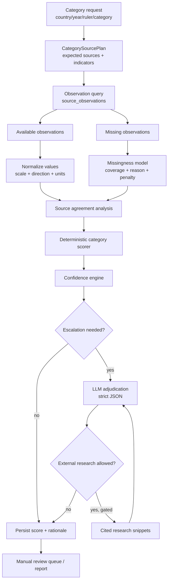
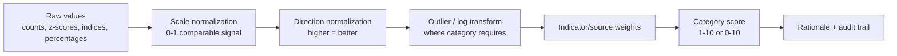
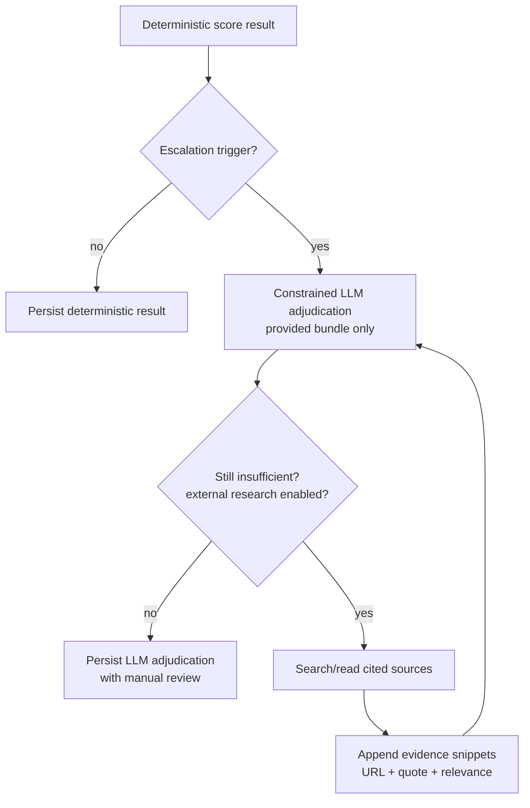

# Architecture — Leaders Database Prototype

This document defines the system design. The authoritative product brief is
[`../requirements/top-level-requirements.md`](../requirements/top-level-requirements.md); section numbers below
reference that document.

## Purpose

`leaders-db` is a local-first Python research prototype that builds an auditable,
confidence-scored database of political leaders and category ratings. It is
designed to reproduce, challenge, explain, and validate the customer's existing
2023 matrix against independent external evidence.

Design-review HTML pages may reuse the read-only repository viewer under
`docs/design-reviews/assets/`. `scripts/serve_design_reviews.py` binds a static server
to localhost, constrains file resolution to an explicit source/documentation allowlist
inside the repository, and rejects mutation methods. The browser component fetches only repository-relative files and renders
source, sanitized Markdown, JSON, and CSV without changing project data.

The static client-results viewer under `docs/client-results/<release>/` is a
separate read-only reporting surface. A deterministic build script joins frozen
dossiers and chapter judgments to the client workbook, writes a repository-local
JSON payload, and presents ruler-by-chapter score pairs, null-aware MSE, evidence
lenses, citations, and judge rationale. Client values remain comparison data only.
The Cloudflare-protected portal publishes these immutable releases through a stable
`/reports/leaders/` year registry. Canonical year routes resolve
`/reports/leaders/<year>/` to `docs/client-results/<year>-top20/`; the registry and
shared selector are the only navigation files updated when another year is released.

The customer/client matrix is a **validation/test reference only**. It is not
ground truth, not an evidence source, and never contributes to source agreement,
source authority, factual claims, leader identity, or category scoring.

## Scope

**In scope (§2):** one target year at a time, initially 2023; countries above the
client's population threshold; canonical, locked formal governing officeholder per
country-year; external indicators per scoring category; evidence-bundle based
provisional category scores; confidence scores; client-matrix comparison;
manual-review queue; source provenance; reproducible local data lake.

**Out of scope for first prototype:** production webapp, multilingual UI, years
before 1900, and unconstrained online LLM browsing as a default scoring path.
LLM-assisted research may be added as an explicitly gated escalation path only
after structured-data and constrained-adjudication paths are testable.

The future source-ingestion architecture is now tracked separately in
[`sources.md`](sources.md). That document defines the
new `leaders_db.sources` subsystem that will replace prototype source ingestion
over time while keeping existing capabilities available as legacy/reference code.

---

## Architectural Principle: Ratings Are Evidence Bundles

A category rating is **not** produced from one raw number. The production target
is:

```text
country + year + ruler + category
    -> expected source set
    -> available observations
    -> missing observations
    -> normalized comparable signals
    -> deterministic score proposal
    -> confidence + disagreement analysis
    -> optional LLM adjudication/research escalation
    -> system_proposed_score + rationale + review status
```

Every generated score must be explainable as:

1. Which sources were expected for this category?
2. Which source files/API endpoints were actually used?
3. Which raw rows/cells/columns produced each indicator value?
4. Which expected indicators were missing and why?
5. How were raw values normalized and direction-adjusted?
6. How were normalized indicators combined into the proposed 1-10 score?
7. How much did sources agree or conflict?
8. Was the data direct-year, proxy-year, stale, or unavailable?
9. Was an LLM used? If yes, what evidence was it given, what did it return, and
   did it perform gated external research?
10. Why is human review required or not required?

The current `vertical_slice_2023` is only a thin proof of DB/output plumbing. It
uses single-source formulas for `social_wellbeing` and `integrity`; this document
defines the intended main pipeline that replaces those provisional formulas.

---

## High-Level Pipeline

```mermaid
flowchart LR
    subgraph inputs[Inputs]
        Client["Client/customer 2023 matrix\nvalidation reference only"]
        RawSources["Structured external datasets\nV-Dem, WDI/WGI, UCDP, SIPRI, PTS, ..."]
        OptionalWeb["Optional external research\nLLM escalation only"]
    end

    subgraph lake[Local Data Lake]
        Raw["data/raw/<source>/\nimmutable files + metadata.json"]
        Processed["data/processed/<source>/\nnormalized parquet/csv"]
        Outputs["data/outputs/\nreports, review queues"]
    end

    subgraph db[(SQLite / PostgreSQL)]
        Sources["sources"]
        Observations["source_observations"]
        RulerYears["ruler_years"]
        Scores["ruler_scores"]
        Validation["validation_results"]
    end

    subgraph stages[Stages 0-15]
        S0["Stage 0\nsource availability"]
        S1["Stage 1\nclient reference loader"]
        S2["Stage 2\nsource adapters"]
        S3["Stage 3\ncountry matching"]
        S4["Stage 4\nleader resolution"]
        S5["Stage 5\nevidence bundle builder"]
        S6["Stage 6-8\nnormalize/align/quality"]
        S9["Stage 9-10\ndeterministic scorers"]
        S11["Stage 11\nconfidence engine"]
        LLM["LLM adjudicator\noptional escalation"]
        S12["Stage 12\nclient comparison"]
        S14["Stage 14\nmanual review queue"]
        S15["Stage 15\nsummary/export"]
    end

    Client --> Raw
    RawSources --> Raw
    Raw --> S0
    Raw --> S1
    Raw --> S2
    S2 --> Processed
    S2 --> Sources
    S2 --> Observations
    S1 --> RulerYears
    S3 --> Observations
    S3 --> RulerYears
    S4 --> RulerYears
    Observations --> S5
    RulerYears --> S5
    S5 --> S6 --> S9 --> S11
    S11 --> Scores
    S11 --> Validation
    S11 -. "low confidence / conflict / missingness" .-> LLM
    OptionalWeb -. "gated only" .-> LLM
    LLM -. "adjudication result" .-> S11
    Scores --> S12 --> S14 --> S15 --> Outputs
    Validation --> S14
```

---

## Evidence Bundle Pipeline


```mermaid
flowchart TD
    A["Category request\ncountry/year/ruler/category"] --> B["CategorySourcePlan\nexpected sources + indicators"]
    B --> C["Observation query\nsource_observations"]
    C --> D["Available observations"]
    C --> E["Missing observations"]
    D --> F["Normalize values\nscale + direction + units"]
    E --> G["Missingness model\ncoverage + reason + penalty"]
    F --> H["Source agreement analysis"]
    G --> H
    H --> I["Deterministic category scorer"]
    I --> J["Confidence engine"]
    J --> K{"Escalation needed?"}
    K -- "no" --> L["Persist score + rationale"]
    K -- "yes" --> M["LLM adjudication\nstrict JSON"]
    M --> N{"External research allowed?"}
    N -- "no" --> L
    N -- "yes, gated" --> O["Cited research snippets"]
    O --> M
    L --> P["Manual review queue / report"]
```

The category scorer must never silently average incompatible indicators. It must
carry every raw observation, normalized value, source weight, missing value, and
disagreement into the rationale and confidence components.

---

## Core Runtime Components

| Component | Module(s) | Stage(s) | Responsibility |
|---|---|---:|---|
| CLI surface | `src/leaders_db/cli.py` | — | Human-facing commands. Must stay thin: load config, call importable seams, print outputs. |
| Run config | `src/leaders_db/config.py`, `configs/*.yaml` | — | Target year, source selection, scoring categories, LLM mode. |
| Path layer | `src/leaders_db/paths.py` | — | Data-lake path helpers (`raw_dir`, `processed_dir`, `outputs_dir`, ...). |
| Database | `src/leaders_db/db/` | — | SQLAlchemy engine/session/models and migrations. |
| Source readiness | `src/leaders_db/ingest/source_availability.py` | 0 | Offline authoritative audit across registry descriptors, raw metadata/files, immutable processed manifests/parquet, the read-only normalized-observation catalog, concept mappings, and the currently executable ruler-evidence concept route. Emits JSON/CSV/Markdown with the ordered readiness states and never labels a merely staged or normalized source “available.” |
| Client reference loader | `src/leaders_db/ingest/client_matrix.py` | 1 | Load customer matrix as validation reference only. Must not create independent source evidence. |
| Legacy Stage 2 source adapters | `src/leaders_db/ingest/<source>*.py` | 2 | Read one external source, normalize raw rows to `source_observations`, write processed parquet/manifest through the original ingest stack. |
| Unified source subsystem | `src/leaders_db/sources/` | 2+ | Registry-backed clean source interface. `SourceIngestRunner(registry)` remains side-effect free for validation/inspection; `SourceIngestRunner(registry, engine=...)` executes `check_ready -> read_raw -> transform -> validate -> persist -> manifest`, writes processed observations under `processed_root/<source>/observations-<run_id>.<format>`, upserts SQL evidence rows idempotently, and writes immutable manifests at `processed_root/<source>/manifest-<run_id>.json`. |
| Legacy adapter registry | `src/leaders_db/ingest/__init__.py` | 2 | `STAGE2_ADAPTERS` dispatch table consumed by legacy CLI paths. The unified source runner uses `leaders_db.sources.registry.SourceRegistry` instead and never consults `STAGE2_ADAPTERS`. |
| Indicator catalogs | `src/leaders_db/ingest/catalogs/<source>.csv` | 2/5 | Source-specific mapping from raw field to canonical `variable_name`, category, direction, unit, scale. |
| Country/year scope | `src/leaders_db/scope/country_year_grid.py` | 3 | Builds the deterministic `countries` and `country_years` base grid from the configured year range; the first implementation uses the current ISO3 universe and reports historical-state/population/disputed-country limitations. |
| Country normalization | `src/leaders_db/normalize/countries.py`, `src/leaders_db/resolve/country_match.py` | 3 | ISO3 matching and alias handling. |
| Ruler identity layer | `src/leaders_db/identity/ruler_identity.py` | 4 | Consumes persisted `normalized_observations` identity families, populates `leaders`, `leader_aliases`, `ruler_spells`, and overlapping `ruler_years`, and reports missing/disputed/multiple/low-confidence/source-conflict coverage without reading raw sources or using the client matrix as evidence. |
| Leader resolution | `src/leaders_db/resolve/leader_resolver.py` | 4 | Future deeper actual-ruler adjudication and person disambiguation across independent leader sources. |
| Evidence bundle builder | `src/leaders_db/resolve/indicators.py` or future `src/leaders_db/score/evidence.py` | 5 | Build a per-country/year/category bundle of expected, available, missing, and proxy observations. |
| Normalization layer | `src/leaders_db/score/normalization.py` plus category helpers | 6-8 | Convert heterogeneous raw values to comparable 0-1 or 0-10 signals with direction. |
| Category scorers | `src/leaders_db/score/<category>.py` (plus private `<category>_*` helpers under the same package) | 9-10 | Deterministic scoring from evidence bundles into `system_proposed_score`. Re-exported from `src/leaders_db/score/__init__.py` so the Stage 9 pipeline imports the scorer through the package root. |
| Category scorer dispatch | `src/leaders_db/score/dispatch.py` | 9 | The single registry mapping `category_key` → scorer function (`_SCORERS`). Adding a category is one line; `get_category_scorer` raises `ValueError` for unsupported keys. |
| Stage 9 orchestration seam | `src/leaders_db/score/stage9.py` | 9 | `score_category_for_country(session, *, country_iso3, year, category_key, leader_name=None)` composes the Stage 5 bundle builder and the Stage 9 dispatcher. Read-only; no `ruler_scores` persistence (deferred until Stage 4 lands). |
| Stage 9 all-countries batch seam | `src/leaders_db/score/stage9.py` | 9 | `score_category_for_all_countries(session, *, year, category_key)` iterates the `countries` table in `iso3` order and delegates each row to the per-country seam; countries whose bundle is below the plan's minimum-viable threshold return a clean `is_insufficient_data=True` `ScoreResult` rather than being dropped. Read-only. The canonical reusable pattern for per-category vertical slices — the 2022 `social_wellbeing_2022_scores.csv` is the first instance. |
| Stage 9 batch CSV writer | `src/leaders_db/score/_stage9_csv.py` (`write_score_results_csv`, `SCORE_RESULTS_CSV_COLUMNS`; re-exported through `src/leaders_db/score/stage9.py`) | 9 | Pandas-free atomic-rename CSV writer. One row per `ScoreResult`. Insufficient-data rows write the literal `"NA"` sentinel for the score pair and pipe-separated `review_flags`. Header columns cover the missingness-investigation contract (`observed_count`, `expected_count`, `missing_count`, `missing_primary_count`, `observation_ref_count`, `rationale_short`). Per AGENTS.md rule #15 the file opens with a `# Attribution: <text>` comment block (one line per contributing source) before the stable `SCORE_RESULTS_CSV_COLUMNS` header; consumers parse with `csv.reader` and skip rows whose first cell starts with `#`, or use `pandas.read_csv(..., comment="#")`. The module is split out of `stage9.py` so the per-country / per-batch seam stays under the 400-line convention; the public import path `from leaders_db.score.stage9 import write_score_results_csv` is stable across the split. |
| Stage 9 CSV attribution mapping | `src/leaders_db/score/_attributions.py` | 9 | Single source of truth for which external sources a Stage 9 public-output CSV must declare in its `# Attribution: <text>` comment block. `CATEGORY_SOURCE_ATTRIBUTIONS` maps `category_key` → tuple of `(source_key, attribution_text)`; `build_attribution_comment_lines(category_key)` returns the comment lines. Texts are byte-for-byte equal to the "Attribution text in reports" strings in `docs/sources/attributions.md` §1 (drift-guarded by `tests/test_score_stage9_attribution.py`). `client_existing` is never included (AGENTS.md rule #6). |
| Confidence engine | `src/leaders_db/score/confidence.py` | 11 | Fixed formula and component score calculation. |
| Concept country-year facts | `src/leaders_db/facts/concept_country_year_facts.py` | 5 | Publishes unit-specific concepts, selected and alternative provenance, fixed confidence components, and source-specific interpretation warnings. |
| Source uncertainty transport | `src/leaders_db/ingest/{vdem_io,wgi_xlsx}.py`, `src/leaders_db/sources/adapters/{vdem,world_bank_wgi}/_transform.py` | 2/5 | Retains V-Dem coding bounds/standard deviations and WGI estimate standard errors/percentile-rank bounds in observation extensions that fact provenance carries forward. |
| Local Evidence Package v3 | `src/leaders_db/research/{local_prior_schema,local_prior_query,local_structured_prior,local_prior_package}.py` | research handoff | Retrieves a bounded pre-accession/tenure/target series, labels each fact's period role, excludes future observations, deduplicates across lenses, and accepts legacy target-year facts. |
| Longitudinal signal derivation | `src/leaders_db/research/local_longitudinal.py` | research handoff | Computes reconstructable level/change/trend/acceleration/average/cumulative/volatility/coverage summaries with exact formulas, source lineage, uncertainty, lag, causal-distance, and attribution warnings; never scores automatically. |
| Controlled peer comparison | `src/leaders_db/research/local_peers.py` | research handoff | Compares country change with explicitly supplied accession-dated peer memberships across five supported definitions, reports coverage and sensitivity, and rejects future-defined peers. Automatic membership construction remains disabled until authoritative dimensions are persisted. |
| LLM adapter | `src/leaders_db/llm/{caller,schemas}.py` | 10/11 escalation | Strict JSON adjudication; optional gated external research later. |
| Comparison | `src/leaders_db/validate/comparison.py` | 12 | Client-vs-system deltas; client remains validation reference only. |
| Manual review queue | `src/leaders_db/validate/manual_review_queue.py` | 14 | Prioritized low-confidence/conflict/missingness/high-delta cases. |
| Summary report | `src/leaders_db/validate/summary_report.py` | 15 | Markdown/CSV exports with source attribution. |

---

## Source Location and Traceability Convention

Every implemented source must have a complete source-location trail. If a source
is vetted but not implemented, the developer must fill the `raw path` and
`locator` fields when the source lands.

For each source, the following must exist or be explicitly marked `not yet
implemented`:

| Artifact | Required location / rule |
|---|---|
| Raw source files | `data/raw/<source>/` (gitignored content, immutable after download). |
| Raw metadata | `data/raw/<source>/metadata.json` (URL, version, license, checksum, coverage, local file names). |
| Source docs | `docs/sources/registry.md`, `docs/sources/attributions.md`, and if complex `docs/architecture/<source>.md`. |
| Indicator catalog | `src/leaders_db/ingest/catalogs/<source>.csv`. This is the contract for raw columns, category, scale, direction, unit, description. |
| Adapter orchestrator | `src/leaders_db/ingest/<source>.py` public `ingest_<source>()`. |
| Reader/parser modules | `src/leaders_db/ingest/<source>_*.py` as needed (`*_csv.py`, `*_xlsx.py`, `*_pdf.py`, `*_http.py`, `*_db.py`, helpers). |
| Legacy processed output | `data/processed/<source>/<source>_country_year.parquet` or source-specific equivalent. |
| Legacy run manifest | `data/processed/<source>/<source>_run_manifest.json`. |
| Unified source processed output | `data/processed/<source>/observations-<run_id>.<format>` (`parquet` by default, optional `csv`). |
| Unified source run manifest | `data/processed/<source>/manifest-<run_id>.json`; an existing run id is immutable unless the new payload is byte-identical. |
| DB rows | `sources` and `source_observations`; `source_row_reference` must identify the raw row/cell/source key, e.g. `undp_hdi:MEX`, `wgi:MEX`, `pts:MEX`. |
| Tests | `tests/test_ingest_<source>.py` and fixtures under `tests/fixtures/<source>/`. |

### Source Locator Table

This table is the main handoff between architecture and implementation. `raw
locator` is how a developer or reviewer finds the exact source cell/row that
produced a number.

| Source key | Status | Raw path / endpoint | Catalog | Adapter entry | Raw locator pattern |
|---|---|---|---|---|---|
| `vdem` | implemented | `data/raw/vdem/V-Dem-CY-Full+Others-v16.csv` | `src/leaders_db/ingest/catalogs/vdem.csv` | `STAGE2_ADAPTERS["vdem"]` | `country_text_id=<ISO3>`, `year=<year>`, raw column from catalog. |
| `world_bank_wdi` | implemented | World Bank WDI v2 API cache under `data/raw/world_bank_wdi/cache/<year>/<indicator>.json` | `src/leaders_db/ingest/catalogs/wdi.csv` | `STAGE2_ADAPTERS["world_bank_wdi"]` | API record `countryiso3code=<ISO3>`, `date=<year>`, indicator code from catalog. |
| `maddison_project` | implemented (2026-06-20), raw xlsx not committed | `data/raw/maddison_project/mpd2023.xlsx` expected for real ingestion; tests use `tests/fixtures/maddison_project/sample.xlsx` | `src/leaders_db/ingest/catalogs/maddison_project.csv` | `STAGE2_ADAPTERS["maddison_project"]` | `Full data` sheet row keyed by `countrycode=<ISO3>`, `year=<year>`; raw columns `gdppc` / `pop`; derived row reference uses `__derived_gdp_total__`; processed parquet at `data/processed/maddison_project/maddison_project_country_year.parquet`; run manifest at `data/processed/maddison_project/maddison_project_run_manifest.json`. |
| `world_bank_wgi` | implemented | `data/raw/world_bank_wgi/wgidataset.xlsx` | `src/leaders_db/ingest/catalogs/wgi.csv` | `STAGE2_ADAPTERS["world_bank_wgi"]` | Sheet = catalog `raw_column`; row `Code=<ISO3>`; `Estimate` column for year. |
| `pwt` | implemented (Phase B Increment B + second-pass reviewer follow-up; updated 2026-06-22) | `data/raw/pwt/pwt1001.xlsx` with `data/raw/pwt/metadata.json` (PWT 10.01; SHA-256 `bf2b66c5fd8b465870eeab8bbfa3a57e73253a3236a933286259efbbb5fb67a2`; CC BY 4.0; 1950-2019) | `src/leaders_db/ingest/sources/pwt/catalog.csv` (per-source package) | `STAGE2_ADAPTERS["pwt"]` → `leaders_db.ingest.sources.pwt.ingest_pwt`; CLI uses `STAGE2_ADAPTERS` directly, registry runner requires `register('pwt', PWTAdapter())` (opt-in by design) | Locator `pwt:Data:<countrycode>:<year>:<raw_column>` (e.g. `pwt:Data:USA:2019:rgdpe`); `Data` sheet columns include `rgdpe`/`rgdpo`/`pop`/`emp`/`avh`/`hc`/`ccon`/`cda`/`ctfp`/`rkna`/`rtfpna`. PWT emits direct observed source-year rows only; target-year requests beyond 2019 emit zero observations + a `requested_year_out_of_coverage` manifest warning (no 2019→2023 stale/proxy fill). Request-scoped `years=` (tuple) and `country_filter=` (tuple of ISO3 codes) are honored end-to-end (registry + `PWTAdapter.ingest(request)`); the DB cleanup pass scopes by `country_filter` so a corrective re-run cannot accidentally delete unscoped iso3 rows. The DB sources row carries the bundle `source_url` / `license_note` from `request.raw_root`'s metadata (NOT the default data-lake). |
| `undp_hdi` | implemented (legacy; clean source adapter 2026-06-26), raw metadata/CSV are runtime-local | `data/raw/undp_hdi/HDR23-24_Composite_indices_complete_time_series.csv` with local `metadata.json` required at runtime | `src/leaders_db/ingest/catalogs/undp_hdi.csv` | Legacy: `STAGE2_ADAPTERS["undp_hdi"]`; clean: `leaders_db.sources.adapters.undp_hdi.register_undp_hdi(registry)` | Wide CSV row `iso3=<ISO3>`; column `{raw_column}_{actual_year}`, e.g. `hdi_2022`. The clean adapter emits `social_wellbeing_country_year` records for non-missing HDI/component cells, preserves ISO3 country code, source-native country display, `region`, `hdicode`, `source_row_reference = "undp_hdi:<ISO3>"`, and maps requested 2023 to actual 2022 proxy rows without relabeling them as 2023. Runtime metadata may use either current `local_files`/`checksum_sha256` shape or the legacy `version` + `source_key` + `sha256` shape. |
| `who_gho_api` | implemented (legacy; clean source adapter 2026-06-27), raw metadata/cache are runtime-local | WHO GHO OData v1 API (`https://ghoapi.azureedge.net/api/`) with a local verbatim JSON cache under `data/raw/who_gho_api/cache/<year>/<IndicatorCode>.json` + local `metadata.json` required at runtime | `src/leaders_db/ingest/catalogs/who_gho_api.csv` | Legacy: `STAGE2_ADAPTERS["who_gho_api"]`; clean: `leaders_db.sources.adapters.who_gho_api.register_who_gho_api(registry)` | API record `IndicatorCode=<raw_column>`, `SpatialDimType=COUNTRY`, `SpatialDim=<ISO3>`, `TimeDim=<year>`, `Dim1` per catalog ``dim1_filter`` (``SEX_BTSX`` for SEX-disaggregated indicators, empty for immunization indicators). The clean adapter emits `social_wellbeing_country_year` records for non-missing cells (5 indicators: `who_gho_life_expectancy`, `who_gho_under5_mortality`, `who_gho_dtp3_immunization`, `who_gho_hepb3_immunization`, `who_gho_bcg_immunization`), preserves ISO3 country code, raw cache path + per-`(year, IndicatorCode)` asset id + `column_name` (raw WHO GHO API code), `source_row_reference = "who_gho_api:<raw_column>:<iso3>"`, the verbatim `Value` audit-trail string, and the `spatial_dim_type=COUNTRY` / `dim1_filter` audit metadata. Runtime readiness accepts BOTH the canonical primary `source_version` shape AND the legacy `version` + `source_url` + `sha256: null` shape. The unified adapter is offline / cache-only: `cache_policy="refresh"` / `"no_cache"` is unsupported and fails readiness with a structured `unsupported_cache_policy` error. |
| `pts` | implemented | `data/raw/political_terror_scale/PTS-2025.xlsx` | `src/leaders_db/ingest/catalogs/pts.csv` | `STAGE2_ADAPTERS["pts"]` | Row country/COW/World Bank code; columns `PTS_A/H/S` and `NA_Status_A/H/S`. |
| `ucdp` | implemented in code, raw not staged in current checkout | `data/raw/ucdp/<ged zip>` when available | `src/leaders_db/ingest/catalogs/ucdp.csv` | `STAGE2_ADAPTERS["ucdp"]` | Event rows filtered by catalog `filter_logic`; aggregate by country-year. |
| `sipri_milex` | implemented (legacy; clean source adapter 2026-06-26) | `data/raw/sipri_milex/SIPRI-Milex-data-1949-2025_v1.2.xlsx` with local `metadata.json` required at runtime | `src/leaders_db/ingest/catalogs/sipri_milex.csv` | Legacy: `STAGE2_ADAPTERS["sipri_milex"]`; clean: `leaders_db.sources.adapters.sipri_milex.register_sipri_milex(registry)` | Workbook sheet = catalog `raw_column`; source-native country display row; year column. The clean adapter emits `international_peace_country_year` records for non-missing country-year indicator cells, leaves `country_code` / leader fields unset, carries `source_row_reference = "sipri_milex:<display_name>"`, and does not fabricate ISO3 or missing values. |
| `sipri_yearbook_ch7` | implemented and live-validated (legacy + clean adapter) | staged official 2024 chapter (space or underscore filename accepted locally) with validated metadata | `src/leaders_db/ingest/catalogs/sipri_yearbook_ch7.csv` | Legacy: `STAGE2_ADAPTERS["sipri_yearbook_ch7"]`; clean: `leaders_db.sources.adapters.sipri_yearbook_ch7.register_sipri_yearbook_ch7(registry)` | Locates and parses PDF Table 7.1 from the real InDesign layout; emits and routes total-inventory, deployed, and retired snapshot facts for nine states with raw cells, missingness, source year, and no fabricated ISO3 or favorable non-exposure inference. |
| `archigos` | implemented (legacy 2026-06-19; clean source adapter 2026-06-26) | `data/raw/archigos/Archigos_4.1_stata14.dta` | `src/leaders_db/ingest/catalogs/archigos.csv` | Legacy: `STAGE2_ADAPTERS["archigos"]`; clean: `leaders_db.sources.adapters.archigos.register_archigos(registry)` | Stata 14 `.dta` row `obsid=<obsid>`; one observation per (leader-spell, catalog `raw_column`) pair, `source_row_reference` = `archigos:<obsid>:<year>:<raw_column>`. The clean adapter emits `leader_identity_spell` records keyed by spell start year, leaves `country_code` / `leader_id` unset, carries source-native `idacr` / `ccode`, and does not fabricate 2023 rows because Archigos ends 2015. |
| `reign` | implemented (legacy 2026-06-19; clean source adapter 2026-06-26) | `data/raw/reign/REIGN_2021_8.csv` | `src/leaders_db/ingest/catalogs/reign.csv` | Legacy: `STAGE2_ADAPTERS["reign"]`; clean: `leaders_db.sources.adapters.reign.register_reign(registry)` | GitHub raw CSV row keyed by ``(country, year, month)``; one observation per (leader-month-row, catalog ``raw_column``) pair, ``source_row_reference`` = ``reign:<country_token>:<leader>:<year>:<month>:<raw_column>``. The clean adapter emits `leader_identity_month` records, leaves `country_code` / `leader_id` unset, carries source-native `country` / `ccode` / `month`, and does not fabricate 2023 rows because REIGN ends 2021-08. |
| `leader_survival` | vetted, **adapter blocked on Demscore email gate** (2026-06-19) | `data/raw/leader_survival/` exists but contains only a placeholder ``.gitkeep``; H-DATA v5 (March 2025) has a manual form/email/gender gate, not yet staged. | not yet created | currently `None` | Once data lands: row leader-spell; raw columns from the future catalog (`leader`, `startdate`, `enddate`, `gender`, `biographical background`, ...). Per AGENTS.md Always-On Rule #6 the adapter is not implemented until the data is placed. |
| `cirights` | implemented (legacy 2026-06-19; clean source adapter 2026-06-26), raw metadata/xlsx are runtime-local | `data/raw/cirights/cirights_v3.12.10.24.xlsx` with local `metadata.json` required at runtime | `src/leaders_db/ingest/catalogs/cirights.csv` | Legacy: `STAGE2_ADAPTERS["cirights"]`; clean: `leaders_db.sources.adapters.cirights.register_cirights(registry)` | Single xlsx sheet ``Sheet1``; source-native country display + actual data year; raw column from catalog. The clean adapter emits `domestic_violence_human_rights_country_year` records for non-missing CIRIGHTS cells, leaves `country_code` / leader fields unset, carries `source_row_reference = "cirights:<safe_country_token>:<year>:<raw_column>"`, and maps requested 2023 to actual 2022 proxy rows without relabeling them as 2023. |
| `transparency_cpi` | implemented | `data/raw/transparency_cpi/transparency_cpi_2023.csv` (HDX-mirrored CSV; publisher URL `https://www.transparency.org/en/cpi/2023`) | `src/leaders_db/ingest/catalogs/transparency_cpi.csv` | `STAGE2_ADAPTERS["transparency_cpi"]` | HDX CSV row ``country,iso3,region,year,score,rank,sources,standardError,lowerCi,upperCi``; ``source_row_reference`` = ``transparency_cpi:<raw_column>:<iso3>``. |
| `fas` | implemented (legacy 2026-06-19; clean source adapter 2026-06-27), raw metadata/HTML are runtime-local | `data/raw/fas/fas_status.html` (FAS consolidated status page snapshot; publisher URL `https://programs.fas.org/ssp/nukes/nuclearweapons/nukestatus.html`) with local `metadata.json` required at runtime | `src/leaders_db/ingest/catalogs/fas.csv` | Legacy: `STAGE2_ADAPTERS["fas"]`; clean: `leaders_db.sources.adapters.fas.register_fas(registry)` | HTML ``<table id="table1">`` country rows (Russia, United States, France, China, United Kingdom, Israel, Pakistan, India, North Korea); ``source_row_reference`` = ``fas:<raw_column>:<country>``. The consolidated snapshot year (2014 as of probe 2026-06-19) is parsed from the page's ``<meta name="date">`` element and stamped on every observation's ``extension.snapshot_year`` field; the unified adapter is local-file only (``requires_network=False``, no HTTP layer) and ``cache_policy="refresh"`` / ``"no_cache"`` is unsupported and fails readiness with a structured ``unsupported_cache_policy`` error. A requested 2023 emits 2014 rows labeled with the snapshot year (no silent relabeling) plus ``extension.requested_year=2023`` / ``proxy_snapshot_semantics`` audit metadata; Stage 11 penalises the temporal-fit gap. |
| `bti` | implemented (2026-06-19) | `data/raw/bti/BTI_2006-2026_Scores.xlsx` | `src/leaders_db/ingest/catalogs/bti.csv` | `STAGE2_ADAPTERS["bti"]` | Multi-sheet xlsx (one sheet per BTI edition 2006-2026). For 2023, the adapter uses the `BTI 2024` sheet (covers 2022-2023) via the ``sheet_for_year()`` helper. Row keyed by country; ``source_row_reference`` = ``bti:<country>``. |
| `rsf_press_freedom` | implemented (2026-06-19) | 24 annual CSVs under `data/raw/rsf_press_freedom/rsf_press_freedom_<year>.csv` (2002-2010, 2012-2026; 2011 direct CSV is absent) | `src/leaders_db/ingest/catalogs/rsf_press_freedom.csv` | `STAGE2_ADAPTERS["rsf_press_freedom"]` | Semicolon-delimited annual CSV with comma decimal separator; BOM-first / cp1252-fallback encoding detection. Pre-2022 schema (16-col wide format with ``Score N`` / ``Rank N``) and 2022+ schema (22-26 cols with 5 component-context columns) both handled. ``source_row_reference`` = ``rsf_press_freedom:<raw_column>:<iso3>``. |
| `polity_v` | implemented (2026-06-27, clean adapter; first "databases not yet in legacy" source) | `data/raw/polity_v/p5v2018.sav` (canonical Polity5 v2018 SPSS bundle, ~1.4 MB, 17574 rows × 37 columns, SHA-256 `c0405a807777610a65fe430e4b4828fda16717afc4b5d6e34bf56f1ca100f2f6`; the user-staged .sav is gitignored per Always-On Rule #9) + runtime-local `metadata.json` (canonical primary shape: `source_version` / `source_url` / `license_note` / `local_files` / `checksum_sha256` / `ingestion_status` / `coverage` / `source_name` / `download_date` / `notes`) | n/a (clean adapter; first post-interface source with no legacy Stage 2 module -- the canonical 11-indicator catalog is documented in `docs/architecture/sources.md` §7.18) | clean: `leaders_db.sources.adapters.polity_v.register_polity_v(registry)`; legacy `STAGE2_ADAPTERS["polity_v"]` slot remains `None` per the "databases not yet in legacy" rule | Country-year SPSS row keyed by `scode=<scode>`, `year=<year>`; raw column from the 11-indicator catalog (`polity` / `polity2` / `democ` / `autoc` / `durable` / `xrreg` / `xrcomp` / `xropen` / `xconst` / `parreg` / `parcomp`); one `NormalizedObservation` per `(country, year, raw_column)` triple; `source_row_reference = "polity_v:<scode>:<year>:<raw_column>"`. Valid ranges are indicator-specific: composite scores (`polity` / `polity2`) use `-10..+10` (valid negatives preserved as numeric); sub-components (`democ` / `autoc` / `xrreg` / `xrcomp` / `xropen` / `xconst` / `parreg` / `parcomp`) use `0..10`; the `durable` indicator is the regime-durability YEARS counter with a valid range of `>= 0` and NO upper cap (long-running regimes produce values up to 170 per the live .sav). Documented special codes `-66` / `-77` / `-88` are emitted as `value=None` / `value_type='missing'` + the verbatim raw cell text on `extension.raw_value` (NOT coerced to numeric). Polity V covers 1800-2018; `years=(2023,)` falls outside the envelope and emits zero observations + a structured `YEAR_ABSENT` warning (no stale-proxy fill per SRC-COV-002 / SRC-COV-003). `leaders=` is unsupported and surfaces a structured `UNSUPPORTED_FILTER` warning per SRC-REQ-005. The raw-read boundary enforces the schema contract -- a staged .sav missing any identity or indicator column raises `PolityVSchemaError` so the transform layer does NOT silently produce partial output. |
| `wikidata_heads_of_state_government` | implemented (legacy 2026-06-19; clean source adapter 2026-06-27), cache/metadata are runtime-local | Wikidata SPARQL endpoint `https://query.wikidata.org/sparql` (CC0 1.0) with a local verbatim JSON cache under `data/raw/wikidata_heads_of_state_government/cache/<cache_key>.json` and local `metadata.json` required at runtime | `src/leaders_db/ingest/catalogs/wikidata_heads_of_state_government.csv` | Legacy: `STAGE2_ADAPTERS["wikidata_heads_of_state_government"]`; clean: `leaders_db.sources.adapters.wikidata_heads_of_state_government.register_wikidata_heads_of_state_government(registry)` | SPARQL ``?headOfState p:P39 ?statement`` pattern; ``source_row_reference`` = ``wikidata:<country_qid>:<office_qid>:<person_qid>:<statement_hash>``. The clean adapter emits `leader_identity_country_year` records from the local cache only (`requires_network=False`), accepts `offline_only` / `prefer_cache`, rejects `refresh` / `no_cache`, leaves `country_code` / `leader_id` unset, treats `countries=` as source-native Wikidata QIDs, rejects multi-year requests explicitly, and preserves the verbatim SPARQL binding JSON plus person/country/office QIDs in the observation extension. |
| `wikipedia_search_extract` | implemented (legacy 2026-06-19; clean source adapter 2026-06-27), cache is runtime-local | Wikipedia Action API `https://en.wikipedia.org/w/api.php` (CC BY-SA 4.0) with a local verbatim JSON cache under `data/raw/wikipedia_search_extract/cache/<cache_key>.json` and an optional `metadata.json` (the canonical primary `source_version` shape AND the legacy alias `version="Action API (no version)"` are both accepted at runtime) | `src/leaders_db/ingest/catalogs/wikipedia_search_extract.csv` | Legacy: `STAGE2_ADAPTERS["wikipedia_search_extract"]`; clean: `leaders_db.sources.adapters.wikipedia_search_extract.register_wikipedia_search_extract(registry)` | Action API ``extracts`` / ``search`` response; ``source_row_reference`` = ``wikipedia:<variable_name>:<hint>`` (e.g. ``wikipedia:wikipedia_extract_lead:<pageid>:<title>``). The clean adapter reads the per-`(query, action)` JSON cache through lazy legacy parser imports, accepts `offline_only` / `prefer_cache`, rejects `refresh` / `no_cache`, maps the canonical query-list input to `request.leaders=`, fails readiness when `leaders=` is empty (the helper does NOT browse / discover), emits `leader_identity_context` observations with `year=None` / `country_code=None` / `leader_id=None` (the Action API responses are not temporally scoped, not country-coded, and not leader-resolved), warns on `years=` / `countries=` (unsupported filters for this source), and preserves the verbatim query string / action / title / pageid / extract text / per-row payload JSON in the observation extension. |

When a developer implements one of the `adapter needed` rows, they must update
this table or the relevant `docs/architecture/<source>.md` with the exact raw
file name and locator pattern in the same commit.

---

## Category Source Plans

Each rating category has an expected source set. The scorer can run with partial
coverage, but missing expected sources must be represented in the evidence
bundle and penalize confidence.

| Category | Primary structured sources | Current implementation state | Notes |
|---|---|---|---|
| `nuclear` | SIPRI Yearbook Ch.7, FAS | Both adapters implemented (Phase C.6, Phase C.10); deterministic scorer implemented (Phase D.9) | Per-source plan at `src/leaders_db/score/category_plans/nuclear.py`; deterministic scorer at `src/leaders_db/score/nuclear.py` (facade) + private `_nuclear_{rubric,components,flags}.py` modules (all ≤ 400 lines). Rubric is a 2-group weighted average (FAS nuclear forces 0.60, SIPRI Yearbook Ch.7 nuclear forces 0.40); `minimum_viable_sources=1` with `SparseDataPolicy.PROVISIONAL_SCORE` — but per requirement §6 "most countries are non-nuclear" the scorer treats every below-threshold bundle as `is_insufficient_data=True` regardless of the plan's `sparse_data_policy` so a non-nuclear state never receives an invented numeric score. The rationale explicitly says "non-nuclear state or no FAS / SIPRI Yearbook Ch.7 row" on the insufficient-data path. The :attr:`ReviewFlag.NUCLEAR_CASE` population-split flag fires on the **scored** path iff the bundle carries any usable FAS / SIPRI Yearbook Ch.7 observation (the §14 manual-review-queue hook per REQ-REV-002); the flag is deliberately not added on the insufficient-data path. Same client-source boundary-exclusion and usable-observation gate as the 7 prior scorers. |
| `international_peace` | UCDP state/internationalized conflict, SIPRI milex | Both adapters implemented (Phase C.4, Phase C.5); deterministic scorer implemented (Phase D.8) | Per-source plan at `src/leaders_db/score/category_plans/international_peace.py`; deterministic scorer at `src/leaders_db/score/international_peace.py` (facade) + private `_international_peace_{rubric,components,flags}.py` modules (all ≤ 400 lines). Rubric is a 2-group weighted average (UCDP conflict involvement 0.65, SIPRI Military Expenditure 0.35); `minimum_viable_sources=2` with `SparseDataPolicy.INSUFFICIENT_DATA` so a below-threshold bundle returns a clean `is_insufficient_data=True` result with the full derived flag set. Same client-source boundary-exclusion and usable-observation gate as `social_wellbeing` / `integrity` / `effectiveness` / `economic_wellbeing` / `political_freedom` / `domestic_violence`. |
| `domestic_violence` | PTS, UCDP one-sided violence, V-Dem repression, CIRIGHTS | All four sources wired (Phase C.7 PTS, C.4 UCDP, C.1 V-Dem, C.10 CIRIGHTS); deterministic scorer implemented | Per-source plan at `src/leaders_db/score/category_plans/domestic_violence.py`; deterministic scorer at `src/leaders_db/score/domestic_violence.py` (facade) + private `_domestic_violence_{rubric,components,flags}.py` modules (all ≤ 400 lines). Rubric is a 4-group weighted average (PTS state-terror 0.30, CIRIGHTS physical-integrity / repression 0.35, UCDP one-sided violence 0.20, V-Dem civil-liberties / repression 0.15); `minimum_viable_sources=2` with `SparseDataPolicy.INSUFFICIENT_DATA` so a below-threshold bundle returns a clean `is_insufficient_data=True` result with the full derived flag set. Same client-source boundary-exclusion and usable-observation gate as `social_wellbeing` / `integrity` / `effectiveness` / `economic_wellbeing` / `political_freedom`. |
| `political_freedom` | V-Dem, Polity V, RSF, Freedom House if provided | V-Dem, RSF, BTI, Wikidata HoS/HoG, Polity V all implemented (Phase C.1, C.10, C.11, Polity V clean adapter 2026-06-27); deterministic scorer implemented | Must compare democracy indices, press freedom, civil liberties; client matrix not evidence. Wikidata provides the 2023+ leader reference. The Polity V clean adapter at `src/leaders_db/sources/adapters/polity_v/` covers historical regime / democracy / autocracy country-year evidence through 2018 (out-of-coverage year 2023 emits zero observations + structured `YEAR_ABSENT` warning per SRC-COV-002 / SRC-COV-003; no stale-proxy fill). Per-source plan at `src/leaders_db/score/category_plans/political_freedom.py`; deterministic scorer at `src/leaders_db/score/political_freedom.py` (facade) + private `_political_freedom_{rubric,components,flags}.py` modules (all ≤ 400 lines). Rubric is a 3-group weighted average (V-Dem democratic / liberal / civil-liberties 0.50, BTI political transformation 0.30, RSF press freedom 0.20); `minimum_viable_sources=2` with `SparseDataPolicy.INSUFFICIENT_DATA` so a below-threshold bundle returns a clean `is_insufficient_data=True` result with the full derived flag set. Same client-source boundary-exclusion and usable-observation gate as `social_wellbeing` / `integrity` / `effectiveness` / `economic_wellbeing`. |
| `economic_wellbeing` | WDI, Maddison Project, PWT, IMF if user-managed | WDI implemented (Phase C.2); Maddison Project implemented (Phase C.11) for historical real-economy coverage through 2022; PWT implemented (Phase B Increment B + second-pass reviewer follow-up; `STAGE2_ADAPTERS["pwt"]` wired to `ingest_pwt`) | Requires cross-country scaling and careful outlier handling. Maddison total real GDP is derived from `gdppc * pop * 1000` and must not be treated as WDI current-USD GDP. PWT covers 1950-2019 and must contribute only direct observed source years; no 2019→2023 stale/proxy fill is allowed. |
| `social_wellbeing` | UNDP HDI, WDI social, WHO GHO | All three sources implemented (Phase C.2, C.8, C.9); deterministic scorer implemented (Phase D.1) | Per-source plan at `src/leaders_db/score/category_plans/social_wellbeing.py`; deterministic scorer at `src/leaders_db/score/social_wellbeing.py` (facade) + private `_social_wellbeing_{rubric,components,flags}.py` modules (all ≤ 400 lines). Rubric is a 5-group weighted average (HDI anchor 0.40, health 0.20, education 0.15, income 0.15, inequality 0.10). The scorer is review-safe: client-matrix sources are stripped at the boundary as defence-in-depth; the minimum-viable gate counts distinct sources of **usable** observations (normalized_value not None, in-plan variable, non-client source) so a source whose row arrived but did not normalize cannot by itself clear the threshold. |
| `integrity` | TI CPI, WGI Control of Corruption, V-Dem corruption | WGI, V-Dem, and TI CPI all implemented (Phase C.3, C.1, C.10) | Must handle direction inversion: V-Dem corruption higher = worse; WGI higher = better. |
| `effectiveness` | WGI governance indicators, BTI, V-Dem constraints/accountability | WGI, V-Dem, and BTI all implemented (Phase C.3, C.1, C.10) | Requires distinguishing democratic constraints from technocratic/governance capacity. |

---

## Evidence Bundle Contract

The production scorer should use an explicit object model (Pydantic or typed
dataclasses) rather than passing loose dictionaries. Proposed contract:

```python
class CategorySourcePlan:
    category_key: str
    expected_sources: tuple[str, ...]
    expected_indicators: tuple[IndicatorSpec, ...]
    minimum_viable_sources: int
    preferred_direct_year: int
    allowed_proxy_years: tuple[int, ...]
    default_source_weights: tuple[tuple[str, float], ...]
    sparse_data_policy: Literal["provisional_score", "insufficient_data"]

class IndicatorSpec:
    variable_name: str
    source_key: str
    role: Literal["required", "preferred", "fallback"]
    direction: Literal["higher_is_better", "lower_is_better"]
    weight: float

class EvidenceObservation:
    source_key: str
    source_name: str
    variable_name: str
    raw_value: str | None
    numeric_value: float | None
    normalized_value: float | None
    unit: str | None
    direction: Literal["higher_is_better", "lower_is_better"]
    observation_year: int | None
    target_year: int
    temporal_kind: Literal["direct", "proxy", "stale", "not_available"]
    source_row_reference: str | None
    authority_score: int
    specificity_score: int
    notes: str | None

class MissingObservation:
    source_key: str
    variable_name: str
    reason: Literal[
        "source_not_implemented",
        "raw_file_absent",
        "country_row_absent",
        "target_year_absent",
        "indicator_null",
        "not_applicable",
        "blocked_or_paywalled",
        "excluded_by_config",
    ]
    severity: Literal["optional", "important", "primary"]

class CategoryEvidenceBundle:
    country_iso3: str
    country_name: str
    leader_name: str | None
    year: int
    category_key: str
    source_plan: CategorySourcePlan
    observations: tuple[EvidenceObservation, ...]
    missing: tuple[MissingObservation, ...]
    category_metadata: Mapping[str, str]
```

The evidence contract is implemented under `src/leaders_db/score/evidence*.py`.
The Stage 5 DB builder lives in `src/leaders_db/resolve/indicators.py`, with
focused helper modules `indicators_sources.py`, `indicators_collection.py`, and
`indicators_selection.py`. Category plans for the first implemented Stage 5
bundle categories live in `src/leaders_db/score/source_plans.py`.

`IndicatorSpec.source_key` is mandatory for production category plans. It is the
canonical owner of that variable (for example, `vdem_v2x_corr` is owned by
`vdem`, not by WGI or Transparency CPI). The bundle builder scopes each
indicator query to its owning source. A row with the right `variable_name` under
the wrong source is ignored and the indicator is reported missing for its owning
source. This prevents cross-source contamination and keeps every
`EvidenceObservation.source_key` and `MissingObservation.source_key` auditable.

---

## Normalization and Deterministic Scoring

Stage 6-10 converts heterogeneous raw data into a category score.


```mermaid
flowchart LR
    Raw["Raw values\ncounts, z-scores, indices, percentages"] --> Scale["Scale normalization\n0-1 comparable signal"]
    Scale --> Direction["Direction normalization\nhigher = better"]
    Direction --> Winsor["Outlier / log transform\nwhere category requires"]
    Winsor --> Weight["Indicator/source weights"]
    Weight --> Score["Category score\n1-10 or 0-10"]
    Score --> Rationale["Rationale + audit trail"]
```

Rules:

- Stage 2 preserves raw values and light numeric coercion; it does **not** hide
  source-specific meaning.
- Stage 5 builds bundles and records missing/proxy/stale indicators.
- Stage 6 normalizes scale and direction.
- Stage 9 category scorers apply category-specific rubrics and weights.
- Score modules must never silently drop a conflicting source; conflict affects
  source agreement and often manual review.
- If fewer than the category's minimum viable sources are available, the scorer
  either emits a low-confidence provisional score or `insufficient_data`, per the
  category plan.

---

## Confidence and Missingness

Implemented confidence formula in `src/leaders_db/score/confidence.py`:

```text
confidence = 0.35 * agreement
           + 0.25 * authority
           + 0.25 * specificity
           + 0.15 * temporal_fit
```

The component derivation should become evidence-bundle based:

| Component | Meaning | Examples |
|---|---|---|
| `agreement` | How consistent are independent sources after normalization? | high when V-Dem/WGI/TI all point same direction; low when sources conflict. |
| `authority` | Weighted quality of available sources, excluding the client matrix. | WDI/WGI/UNDP/V-Dem high; ad hoc web snippets lower. |
| `specificity` | How directly the observation measures the country/year/ruler/category. | ruler-specific > country-year > regional proxy > narrative evidence. |
| `temporal_fit` | Whether evidence is direct-year, proxy-year, stale, or absent. | 2023 direct = high; 2022 proxy = medium-high; 2018 for 2023 = lower. |

Missingness is not an error by itself. It is part of confidence and review
status. The system must distinguish:

- source not implemented yet;
- raw file absent;
- source has no country row;
- source has country row but no target year;
- source has target year but missing/null indicator;
- country did not exist / not applicable;
- source blocked/paywalled/user-managed.
- source intentionally excluded by run configuration.

---

## LLM Adjudication and External Research

The LLM is an escalation layer, not the default deterministic scorer. The Level 1/2
flow below applies to deterministic-score adjudication only; it does not govern the
separate ruler-quality dossier workflow later in this section.

### Level 1 — constrained adjudication

Use this first. Trigger when structured scoring has low confidence, conflicting
sources, severe missingness, ruler ambiguity, or high client delta. The LLM sees
only the assembled evidence bundle, category rubric, and strict JSON schema. It
must not browse or invent facts.

### Level 2 — gated deterministic-score research

Only after Level 1 is implemented and reviewed, the system may allow an LLM or
agent to look for additional papers/articles/web sources. This must be explicit
in config and captured in the output. External research output is stored as
cited evidence snippets, not as untraceable model memory.


```mermaid
flowchart TD
    A["Deterministic score result"] --> B{"Escalation trigger?"}
    B -- "no" --> C["Persist deterministic result"]
    B -- "yes" --> D["Constrained LLM adjudication\nprovided bundle only"]
    D --> E{"Still insufficient?\nexternal research enabled?"}
    E -- "no" --> F["Persist LLM adjudication\nwith manual review"]
    E -- "yes" --> G["Search/read cited sources"]
    G --> H["Append evidence snippets\nURL + quote + relevance"]
    H --> D
```

Forbidden in all LLM modes:

- replacing structured datasets with model opinion;
- citing sources not actually provided or fetched;
- counting the client matrix as evidence;
- silently resolving leader identity;
- publishing an LLM score without identity, citation, period, and provenance validation.
  Harmless handoff formatting is normalized separately with audit warnings.

Ruler-quality research preparation also has a hard identity boundary. The
local-prior slice builder recomputes the current identity coverage diagnostic
instead of trusting a possibly stale persisted adjudication status. Only
deterministically resolved cases whose selected ruler remains among the current
evidence-backed candidates are written into `shard_plan.json`. Missing,
contested, disputed, low-confidence, source-conflict, and stale-selection cases
remain auditable local-prior artifacts but are listed in
`identity_quarantine.json` and cannot be dispatched until identity is rebuilt or
reviewed.

Long dossier and judge runs are coordinated through the migration-0006 research
job ledger plus migration-0007 lease fencing. Run-scoped stable keys prevent
duplicate planning; compare-and-set claims, rotating lease tokens, checkpoints,
bounded retries, quarantine, and append-only events make worker execution
resumable without stale-worker writes. Eight chapter-judge jobs and their
eligible ruler-dossier dependencies are created atomically. Judges cannot be
claimed until usable dependencies finish; terminal unavailable dossiers are
reconciled into the judge's missing-case manifest instead of blocking forever.
The executable judge reads those completed dossier artifacts and its versioned
chapter guide without performing new discovery. Parent-side validation requires
one evaluation per available dossier and checks every decisive evidence ID
against that dossier. The immutable batch artifact records model and token usage;
all `chapter_scores` rows and ledger completion commit atomically under the active
lease token, preventing stale or partial publication.

Each validated dossier also carries a cited twelve-part evidence-environment
assessment. Chapter projection preserves that assessment verbatim, and the judge
must return a structured bias assessment whose supporting IDs resolve within the
same projection. Current producers use strict schemas. Consumer-side normalization
keeps usable incomplete or legacy artifacts judgeable by marking omitted assessments
unresolved, capping confidence, and widening ranges; cross-dossier references and
genuinely unusable inputs remain validation errors.

If a formatter retains valid evidence but omits exact lens routing, normalization first
recovers explicit local-prior and coverage mappings, then exposes any remaining item as
advisory context at each selected chapter boundary. This preserves the source record
without claiming lens relevance; the chapter judge applies the guide's scope gates.

Dossier research uses the versioned controls in `configs/research-workflow.yaml`.
Before research, parent-side `local_structured_prior_v2` extraction covers every
selected lens across all eight chapters and persists the complete hashed artifact.
The researcher and formatter receive a deduplicated `ruler_local_prior_package_v1`,
so identical facts are represented once with source-observation provenance and
candidate lens links rather than repeated across question payloads. Missing facts
remain explicit gaps and country-level indicators are not automatically attributed
to the ruler.
For the complete eight-chapter scope, one persistent evidence researcher works
through chapters 1B–8B and their lenses in order. It begins with one broad
ruler-period reconnaissance, then builds a lightweight candidate URL pool for each
chapter using broad, archive/source-specific, adverse, and local-language searches.
Historical searches do not use recent-news filters. Candidate discovery precedes
source admissibility: promising underlying pages and documents are opened, claims and
locators are extracted, and only then are accepted items added to the growing ledger.
It writes a schema-light
notebook/handoff plus a minimal stable-key/disposition/chapter/exact-lens accounting manifest, aiming
for 5–20 defensible
source-claim units per chapter (normally about 10), while reporting mapped units
separately from independent locator/source families and accepting documented sparse-case
shortfalls. A separate configured formatter converts the handoff into the strict
dossier without new research. Every accepted final-evidence key must survive unchanged
and remain routed to every chapter and exact lens in the manifest; otherwise formatting
fails. Before an individual lens can remain empty, the researcher performs and records a
plain-language source-landscape pass across the mechanisms named by that lens; chapter
abundance or a structured country baseline cannot substitute for that check.
Research and review preserve the job's exact selected-lens scope: full-ruler jobs cover
all selected lenses, while bounded diagnostic pilots do not expand to sibling lenses.
Mapping-backed coverage is
authoritative; absent or unexplained formatting output remains `research_blocked`
rather than becoming `no_evidence_found`. Retry recovery considers only structurally
valid candidates. A no-search reviewer inspects every selected chapter and may
return gaps for up to three bounded research rounds. The primary low-cost researcher owns
the initial pass and one continuation; later recoverable gaps trigger a fresh search-enabled
supervisor session over the accumulated notebook. A final all-chapter review follows the
last takeover, and an omitted-chapter review receives one bounded scope-repair turn rather
than failing the ruler job. The researcher
maintains one append-only global evidence ledger rather than chapter-specific copies.
New records carry canonical source-locator-claim keys and precise locators;
gateway-only and missing-locator candidates remain non-final but identified sources
with missing locators are recoverable extraction tasks rather than proof of absence.
The reviewer excludes duplicates and bundled claims, requires continuation for named
unfetched sources or incomplete discovery patterns, and does not use predicted marginal
value or workflow exhaustion as a saturation finding. Every current chapter review also
records whether favorable and adverse searches were balanced; how closed-system silence
and open-system complaint visibility affect interpretation; whether repeated coverage
describes one event; whether allegations and findings remain distinct; whether official
claims have independent checks; whether population, exposure, authority, inherited
baseline, and shocks are addressed; and which material source type remains missing.
Reviewer evidence IDs must occur in the notebook. Legacy reviews remain usable with an
explicit unassessed-bias marker instead of being discarded.
An honestly sparse chapter remains valid when the researcher records the searches,
rejections, and remaining gaps. After formatting,
one no-search judge per chapter/year batch applies the common meter across rulers,
and a score/order auditor checks the resulting comparative ordering and rubric drift.
Every judge attempt also writes a null-recovery queue from the judgment's existing
reason, weak-lens, and review fields. Recoverable nulls are marked for continuation in
the same ruler-research workflow for no more than two targeted rounds; the queue does
not launch that continuation and no additional worker role is introduced.

Trusted parent event logs also supply cached-input and reasoning-output counters.
The checked-in `configs/research-pricing.yaml` snapshot converts them to
API-equivalent dollars, Codex-credit equivalents where published, and unique
Parallel Search charges. These are not actual subscription-plan cash charges.
Because one Codex execution-turn total can combine multiple provider requests, a
total above a long-context threshold produces lower and upper bounds.

Search activity is driven by chapter evidence needs, not a fixed call allowance.
Every researcher, reviewer, formatter, and judge turn remains separately auditable.

---

## Database Schema

The 11-table schema from §7 is the source of truth and lives in
[`database-schema.md`](database-schema.md). SQL DDL is at
[`src/leaders_db/db/migrations/0001_initial.sql`](../../src/leaders_db/db/migrations/0001_initial.sql);
ORM models are at [`src/leaders_db/db/models.py`](../../src/leaders_db/db/models.py).

Critical invariants:

- `ruler_scores` keeps `client_score`, `system_proposed_score`, `final_score`,
  and `score_delta_vs_client` separate.
- The client matrix is not evidence and is never counted in
  `source_observations`, source agreement, or source authority.
- `source_observations` carries raw value, normalized value, source row
  reference, country/leader/year where applicable, and source provenance.
- `validation_results` records confidence components and validation status.
- `final_score` is set only by manual review or explicit accept workflow.

Future schema additions may be needed for durable evidence bundles, missingness,
LLM adjudication records, and external research snippets. Until then, outputs can
materialize them as JSON/CSV under `data/outputs/` and as `validation_note` text.

---

## Local Data Lake

See [`local-data-store.md`](local-data-store.md). Folder rules:

- `data/raw/<source>/` is immutable; each folder carries a `metadata.json`.
- `data/processed/` is deterministic normalized output; re-runs are idempotent.
- `data/interim/` is mid-pipeline scratch (evidence bundles before scoring).
- `data/outputs/` is the public interface — reports, validation CSVs,
  manual-review queue, score explanations.
- `data/logs/` is per-run logs.
- `data/metadata/` is cross-source metadata such as country aliases and source
  authority tables.

---

## Pipeline Verification Plan From Current State

Before activating the full client scope, we should run targeted pipeline checks
that exercise both happy paths and hard cases. These are the cases to build next.

### Case A — all data exists for a simple category

- **Goal:** prove evidence bundle -> normalization -> deterministic scorer ->
  confidence -> outputs.
- **Candidate:** Mexico 2023 `social_wellbeing` using UNDP HDI + WDI social.
- **Current prerequisites:** implemented (`undp_hdi`, `world_bank_wdi`, `who_gho_api`).
- **Expected behavior:** direct WDI 2023 + UNDP 2022 proxy produce a score, a
  proxy note, and confidence penalty.

### Case B — many indicators, mixed directions

- **Goal:** prove direction normalization and weighted combining.
- **Candidate:** Mexico 2023 `integrity` using WGI Control of Corruption + V-Dem
  corruption indicators.
- **Current prerequisites:** implemented (`world_bank_wgi`, `vdem`).
- **Expected behavior:** WGI higher = better; V-Dem corruption higher = worse;
  scorer must invert V-Dem and record agreement/disagreement.

### Case C — missing primary source but useful secondary source

- **Goal:** prove missingness does not kill the run and confidence drops.
- **Candidate:** `political_freedom` before RSF/Polity/Freedom House adapters are
  implemented, using V-Dem only.
- **Current prerequisites:** V-Dem implemented; RSF raw exists but adapter needed.
- **Expected behavior:** provisional score or `insufficient_data` per category
  threshold; missing RSF/Polity/Freedom House recorded.

### Case D — source conflict

- **Goal:** prove disagreement detection and manual-review routing.
- **Candidate:** `domestic_violence` using PTS + V-Dem repression + CIRIGHTS
  once CIRIGHTS adapter lands.
- **Current prerequisites:** PTS and V-Dem implemented; CIRIGHTS raw on disk,
  adapter needed.
- **Expected behavior:** conflicting indicators reduce agreement score and raise
  manual review.

### Case E — aggregation source

- **Goal:** prove event-level data aggregates correctly before scoring.
- **Candidate:** `international_peace` using UCDP event counts/fatalities.
- **Current prerequisites:** UCDP adapter code exists; raw file needs staging or
  reacquisition in this checkout.
- **Expected behavior:** event rows aggregate to country-year observations; zero
  events are distinguishable from missing raw data.

### Case F — not applicable / sparse category

- **Goal:** define nuclear behavior for non-nuclear and nuclear states.
- **Candidate:** Mexico vs USA/China/Russia `nuclear`.
- **Current prerequisites:** SIPRI Yearbook Ch.7 adapter code exists; FAS adapter
  needed for cross-validation.
- **Implementation:** landed (Phase D.9). The nuclear scorer routes every
  below-threshold bundle through the `is_insufficient_data=True` path with both
  scores `None` and a rationale that explicitly says "non-nuclear state or no
  FAS / SIPRI Yearbook Ch.7 row" (a non-nuclear state must never receive an
  invented numeric score). Nuclear-armed countries with usable observations
  emit a numeric score and the `NUCLEAR_CASE` population-split flag fires on
  the scored path. See `src/leaders_db/score/nuclear.py` and the focused
  test surface (`test_score_nuclear.py` +
  `test_score_nuclear_insufficient_flags.py`).
- **Expected behavior:** non-nuclear country is explicit `not_applicable` by
  rule, not invented by accident; nuclear states require manual review
  (the `NUCLEAR_CASE` flag) when at least one source is present.

### Case G — stale/proxy historical data

- **Goal:** prove temporal-fit penalties.
- **Candidate:** a country/category where only 2022 data exists for 2023, or
  Polity V 2018 used as a stale political-freedom backstop.
- **Current prerequisites:** UNDP HDI proxy path exists; Polity V clean adapter
  landed 2026-06-27 (`src/leaders_db/sources/adapters/polity_v/`).
- **Expected behavior:** score may be produced, but temporal fit and review
  status reflect staleness.

### Case H — LLM constrained adjudication

- **Goal:** prove strict JSON LLM use without browsing.
- **Candidate:** a low-confidence/conflict `integrity` or `domestic_violence`
  evidence bundle.
- **Current prerequisites:** evidence bundle object, deterministic scorer, LLM
  schema extension if needed.
- **Expected behavior:** LLM receives only bundle/rubric/snippets, returns JSON,
  and output records `llm_used=true` plus review reason.

### Case I — gated LLM external research

- **Goal:** future proof only after Case H passes.
- **Candidate:** source-thin historical leader/category case.
- **Current prerequisites:** explicit config flag, citation capture, web-search
  evidence model, reviewer gate.
- **Expected behavior:** external snippets have URLs, quotes/claims, relevance,
  and are not treated as equivalent to structured datasets.

### Recommended next build order

From the current project state, the fastest path to checking the pipeline fully
is:

1. Implement the evidence bundle contract for `social_wellbeing` and `integrity`.
2. Add deterministic scorers for those two categories using already implemented
   UNDP/WDI/WGI/V-Dem data.
3. Add bundle-level missingness/confidence output.
4. Extend the vertical slice or create a new `run-pipeline-smoke` command that
   exercises Cases A-C.
5. Implement one missing adapter that adds a genuinely new challenge:
   `rsf_press_freedom` for political freedom or `cirights` for domestic violence.
6. Add conflict/missingness tests (Cases D/G).
7. Only then add constrained LLM adjudication (Case H).
8. Defer gated web research (Case I) until the structured and constrained LLM
   paths are stable and reviewed.

---

## Historical-Year Handling

Older years degrade gracefully (§13): fewer sources, more proxy/stale data,
lower temporal fit, higher manual-review priority, and more `not_available`
fields. The pipeline records absence explicitly and never fills historical gaps
with invented values.

Years before 1900 are out of scope for the first prototype.

---

## Cross-Cutting Concerns

- **Reproducibility:** every run is determined by config plus `data/raw/`,
  source metadata, indicator catalogs, and code version.
- **Idempotency:** re-running stages with the same source files produces the
  same observations and score outputs.
- **Auditability:** every score must trace back to source observations and raw
  locators.
- **Attribution:** every public output includes relevant blocks from
  `docs/sources/attributions.md`.
- **Tests:** each implemented stage needs unit tests and at least one boundary
  test that fails if the production wiring is removed.

---

## Acceptance Criteria

### Isolated conversational evidence collector

`src/leaders_db/conversational_evidence/` is an experimental swappable evidence-only
module and does not import the canonical dossier worker, reviewer, formatter, or job
ledger. Its data-owned question catalog, prompts, and researcher configurations drive
provider/model-selectable persistent research conversations. Each researcher Markdown
turn is preserved before a stateless Luna call
transcribes it without search or new summaries. A small deterministic store validates
URLs and question IDs, deduplicates claim-level evidence, and writes separate evidence
and evidence-to-lens mapping files with an atomic resume checkpoint. Context exhaustion
starts a new researcher thread from the accumulated evidence index, and per-turn plus
aggregate profiles preserve runtime, usage, tool, failure, coverage, and cost data.

The additive `hybrid_experiment/` runner is a controlled alternative, not a replacement
for that collector. It builds a client-excluding local-prior package, keeps one persistent
research thread for reconnaissance plus eight chapter-wide turns, assigns stable IDs to
canonical URLs, reports mechanical quality warnings, permits one reviewer-directed grouped
follow-up, and uses separate no-search review and formatting turns. It fingerprints the
production collector before each run and stores all state beneath a separate experiment
run key, so accepting or removing the experiment does not alter historical results.
Its v2 ledger contract accepts only machine-parseable source-claim units carrying the
direct URL, precise claim and locator, source confidence, period fit, ruler attribution,
final-evidence use, contrary evidence, and exact lens mappings. Stable evidence IDs are
derived in guide
order; exact reuse is explicit; canonical URLs and claim keys are deduplicated in parent
code. Final dossier serialization is deterministic and preserves reviewer dispositions,
so formatting cannot add evidence or silently infer mappings. A sibling batch supervisor
requires hash-locked, reviewed identities and successful 80-lens local-prior preflight,
then reserves both per-ruler and batch-wide cost ceilings before launching resumable,
staged-concurrency jobs.
The parser tolerates only conventional Markdown list and inline-code wrappers around an
otherwise strict record. Valid sibling records are retained when one line is malformed;
the rejected line's number, validation reason, and SHA-256 are persisted outside the
ledger. Resume can promote a completed, valid model turn left unfiled by an earlier
validator failure. Retry limits count consecutive no-progress failures, while any new
durable stage artifact resets the counter.
The optional batch supervisor runs a data-defined ruler roster with bounded staged
concurrency. It stores an immutable manifest snapshot, per-job status and retry counts,
append-only process logs, and periodic aggregate profiles. Re-running the same command
resumes each dossier from its atomic session checkpoint; `--retry-failed` explicitly
reopens only terminal jobs after a generic repair. Resource profiles include both the
worker-process CPU/RSS footprint and whole-machine CPU/memory so provider latency can be
distinguished from local saturation.
A candidate-heavy mode adds a stricter, resumable research topology without replacing
the canonical collector. One persistent researcher performs ruler reconnaissance and
then processes chapters in order. Parent code counts canonical URLs, continues discovery
until the configured target or round ceiling, partitions candidate IDs into bounded
inspection waves, and rejects a final ledger unless its parsed source rows satisfy the
configured count and unique-URL constraints. If a model returns an oversized ledger,
that raw artifact remains intact and a separately named selection artifact becomes
authoritative only after deterministic validation. Scientific controls live in
`data/deep-workflow.json`; prompt text remains in `data/deep-prompts.json`.
A deterministic conversion gate bridges this experimental format to the canonical
`ruler_evidence_dossier_v2` and `ruler_chapter_projection_v1` contracts. It requires an
exact catalog ruler-year identity, validates all 80 mappings, preserves uncaptured
source metadata as explicit missingness, and writes one cohort manifest per chapter.
For hybrid-v2 dossiers, the same gate preserves precise locators, canonical fact keys,
source confidence, period fit, ruler attribution, contrary evidence, and rich usage
telemetry. Chapter-specific reviewer exclusions are removed from judge mappings while
uncovered lenses become explicit `no_evidence_found` coverage rather than fabricated
midpoints. The target year is carried through compaction, judge keys, prompts, and output
validation; it is never hard-coded to the year of an earlier experiment.
Partial projections remain recoverable, but a cohort with an identity blocker is marked
non-runnable. Each cohort also records the same conservative three-bytes-per-token input
estimate used by the judge worker so context overflow is discovered before any LLM call.
The conversational judging seam adds a reversible compact projection. Within each lens,
it selects by evidence relation and final-use status before confidence and source-domain
diversity, and prefers an unused equal-quality record across broadly mapped lenses. It
then retains up to one distinct final-evidence record per chapter lens as a bounded
chapter-context fallback for usable evidence whose producer supplied only chapter-level
routing; discovery-only records cannot fill that fallback. It preserves every omitted
evidence ID and source projection in an omission ledger, enforces both token and Codex
character limits, and never mutates the full dossier. Saved judge candidates can be deterministically repaired
for harmless lens-list overlap, batch-wide confidence scaling, and unknown reference
removal. A stale dossier key may be rebound before citation filtering only when exactly
one trusted cohort projection matches all immutable ruler-period identity fields;
ambiguous or conflicting identities remain blocked. Material projection-reference cases remain flagged until a separate no-search
review clears or returns them for rejudgment.
Chapter subsets can be rerun under distinct run keys without replacing the original
eight-chapter batch. A release-owned judgment-selection manifest chooses explicit
chapter artifacts for the viewer. Run-scoped audit instructions may exclude identified
out-of-scope evidence but may not prescribe scores; the judge still applies the complete
guide and common cohort meter. Chapter 3B additionally distinguishes systematic
repression from the historical mass-terror floor and gives decentralized conduct weight
only where national-ruler command, encouragement, tolerance, obstruction, or feasible
failure to remedy is evidenced.
When an auditor identifies concrete inadmissible IDs, the conversational scope-filter
layer removes those evidence records, mappings, and coverage references before a fresh
judge call. It writes a complete per-ruler removal and requested-but-absent ledger and
never mutates the compact source projections. This is stronger than asking the model to
ignore known contamination in prose and keeps every rejected attempt recoverable.

The first prototype is successful when, per §16 and the expanded architecture:

- it loads the client's 2023 matrix as validation reference only;
- it ingests local copies of the priority datasets used in the smoke scope;
- it normalizes countries and years;
- it resolves 2023 rulers for at least 50 countries (preferably all client-scored
  countries);
- it builds category evidence bundles with available/missing/proxy indicators;
- it generates provisional scores for at least four categories using multi-source
  evidence where available;
- it produces confidence components and final confidence for every generated
  item;
- it identifies source disagreement, missingness, stale data, and high deltas;
- it produces a manual-review queue and summary report;
- it avoids silent overwriting of client values;
- it avoids unsupported LLM-generated facts.

## Phase Order

Work is split into five sequential phases (see [`../workplan.md`](../workplan.md)):

- **A. Infrastructure** — package, CLI, schema, paths, configs, data lake.
- **B. Source vetting** — source availability/license/coverage probe.
- **C. Data acquisition** — Stage 0-2 source adapters.
- **D. Testing** — coverage, boundary tests, smoke pipeline cases.
- **E. Activation** — Stage 3-15 on the full client 2023 scope.
