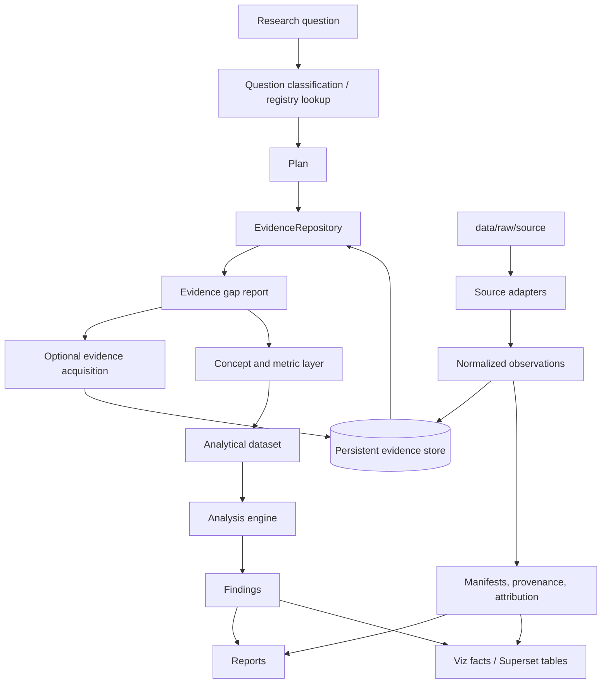

# Architecture — Research Engine

## Purpose

The research engine turns reusable source evidence into analytical datasets,
findings, reports, and visualization tables.

For implementation-level contracts, object shapes, artifact layouts, and test
surfaces, see
[`research-engine-implementation.md`](research-engine-implementation.md).

It extends the current leader-validation prototype without replacing the core
rules: raw data stays local, source provenance is preserved, client data remains
validation-only, and every public output carries attribution.

The core evidence unit is intentionally simple: a normalized database row with
generic scope dimensions, an indicator key, a value, source metadata, and
provenance. Answers and findings point to evidence row ids; evidence rows point
to original files, API records, URLs, quotes, or document locators.

## One-line architecture

```text
research question
  -> registered or LLM-assisted question classification
  -> investigation plan
  -> evidence repository query
  -> evidence gap report
  -> optional targeted evidence acquisition
  -> concept / metric extraction
  -> analytical dataset
  -> analysis + findings
  -> reports + Superset-ready tables
```

## System diagram



## Layers

### 1. Source layer

Owned by `leaders_db.sources`.

Responsibility:

- read raw source material;
- emit `NormalizedObservation` records;
- preserve raw locators, source version, warnings, and attribution;
- never silently fill missing data.

Already started:

- `SourceAdapter` protocol;
- `SourceIngestRequest`;
- `NormalizedObservation`;
- `SourceIngestRunner`;
- clean adapters under `src/leaders_db/sources/adapters/`.

Target lifecycle:

```text
check_ready -> read_raw -> transform -> validate -> persist -> manifest
```

### 2. Persistent evidence repository

The evidence repository is the reusable read boundary over ingested evidence.

Adapters write observations once. Research, scoring, reporting, and viz read them
many times.

Current implementation:

- `InMemoryEvidenceRepository` for tests and slices.
- `SqlEvidenceRepository` backed by SQLite for persisted normalized observations
  in `normalized_observations`.

Future implementation:

- PostgreSQL deployment hardening for the same repository boundary.

The query API remains:

```python
EvidenceQuery(
    source_ids=(SourceId("maddison_project"),),
    observation_families=("economic_country_year",),
    indicator_codes=("gdppc", "pop"),
    scope_filter=ScopeFilter(filters=(
        DimensionFilter(key="country", values=("SWE",), role="entity"),
        DimensionFilter(key="year", values=(1962,), role="time"),
    )),
)
```

### 3. Concept and metric layer

This layer translates source-native indicators into stable analytical meaning.

Examples:

- `gdppc` + `pop` from Maddison -> `gdp_total`;
- WDI GDP current USD -> `gdp_total_nominal_usd`;
- PWT output/population -> `gdp_per_capita`.

Distinction:

| Layer | Meaning |
|---|---|
| Observation | A normalized source fact, stored once. |
| Concept | A source-independent semantic variable, e.g. `gdp_total`. |
| Metric | A chart/report-ready definition with unit, grain, aggregation, transforms, and policy. |

Current implementation:

- `leaders_db.sources.concepts`;
- `leaders_db.viz.metrics`;
- `leaders_db.viz.concept_bridge`, the explicit bridge from stable source
  concepts (`gdp_per_capita`, `population`, `gdp_total`) to chart/report-ready
  metrics (`concept.gdp_per_capita`, `concept.population`, `concept.gdp_total`).

The first bridge policy is explicit: source diagnostics and precedence use
`world_bank_wdi -> maddison_project -> pwt` unless callers provide a narrower
`source_ids` request. Missing requested/precedence sources still produce coverage
diagnostics with zero observation/concept rows so absence is visible instead of
silently omitted.

### 4. Research engine layer

This is the new orchestration layer.

It answers:

- what is the question asking?
- what concepts and metrics are needed?
- which generic scope dimensions and sources are in scope?
- what table should be built?
- what analyses should be run?
- what findings and artifacts should be produced?

Proposed package:

```text
src/leaders_db/research/
├── questions.py
├── planner.py
├── dataset_builder.py
├── analysis.py
├── findings.py
├── runner.py
└── artifacts.py
```

Core objects:

```python
ResearchQuestion
InvestigationPlan
AnalyticalDataset
AnalysisResult
Finding
ResearchRunResult
```

### 5. Analysis engine

The analysis engine computes reusable analytical operations over an analytical
dataset.

Initial operations:

- trend over time;
- CAGR / growth rate;
- ranking by year;
- before/after comparison;
- source coverage and missingness;
- source disagreement;
- outlier detection.

Later operations:

- cohort comparison;
- correlation exploration;
- confidence-weighted aggregation;
- event-window analysis.

### 6. Reporting layer

The reporting layer turns structured findings into human-readable outputs.

Outputs:

- Markdown report;
- HTML report;
- CSV appendix;
- JSON findings;
- chart-ready CSV;
- Superset table registration.

Every report must include:

- question;
- scope;
- methods;
- findings;
- caveats;
- missingness;
- confidence;
- source attribution.

### 7. Visualization layer

Superset is a read-only presentation surface.

It consumes prepared tables from `leaders_db.viz` and research-run artifacts. It
must not own source precedence, scoring, confidence, or official metric logic.

Existing base:

- `viz_country_year_metrics`;
- `viz_metric_catalog`;
- Superset SQLite builder;
- local Superset deployment;
- investigation-slice output table.

## Example flow: Sweden GDP in 1962

Question:

```text
What was Sweden's GDP in 1962?
```

Plan:

```python
InvestigationPlan(
    concepts=("gdp_total",),
    scope_filter=ScopeFilter(filters=(
        DimensionFilter(key="country", values=("SWE",), role="entity"),
        DimensionFilter(key="year", values=(1962,), role="time"),
    )),
    preferred_sources=("maddison_project", "pwt", "world_bank_wdi"),
    analyses=("point_lookup", "coverage"),
)
```

Evidence query:

```python
EvidenceQuery(
    observation_families=("economic_country_year",),
    scope_filter=ScopeFilter(filters=(
        DimensionFilter(key="country", values=("SWE",), role="entity"),
        DimensionFilter(key="year", values=(1962,), role="time"),
    )),
)
```

Concept extraction:

```text
Maddison gdppc + Maddison pop -> gdp_total
```

Answer row:

```text
row_scope_json: {"country":"SWE","year":1962}
concept: gdp_total
value: <derived value>
unit: <source-compatible GDP unit>
source: maddison_project
provenance: input observation ids + raw locators
caveat: historical estimate, unit-specific
```

## Example flow: GDP table for all countries, 1900-2026

Question:

```text
Create a GDP table for all countries between 1900 and 2026.
```

The source observations are not recreated per question. They are reused from the
persistent evidence store.

The research run creates a derived artifact:

```text
data/outputs/research/<run-id>/analytical-dataset.csv
```

Expected row grain:

```text
scope_json, concept, value, unit, source, coverage_status
```

For `leaders-db` convenience outputs, `scope_json` may also be flattened into
columns such as `country`, `year`, `ruler`, or `category`.

Rows for unavailable years remain explicit missing rows or coverage rows. The
engine must not silently project 2024 data into 2026. These explicit missing
rows are analytical/coverage artifacts for the research run; they are not stored
as source observations.

## Persistence model

Short term:

- keep existing 11-table schema;
- add source-run artifacts under `data/processed/<source>/` and
  `data/outputs/research/<run-id>/`;
- add `SqlEvidenceRepository` over a new normalized-observation table or a
  compatibility view.

Recommended new table:

```text
normalized_observations
```

This table would be the persistent implementation detail behind
`EvidenceRepository`. It must either remain compatible with the existing
`source_observations` provenance trail or become its reviewed replacement in a
future schema migration.

Minimum columns:

```text
source_slug
observation_id
observation_family
indicator_code
scope_json
value_json
value_type
unit
scale
source_version
raw_locator_json
transform_locator_json
quality_flags_json
warnings_json
extension_json
run_id
created_at
```

Project-specific dimensions such as country, year, ruler, category, event, or
source are stored inside `scope_json` for the generic research engine. Convenience
views may flatten common dimensions for `leaders-db` and Superset.

Research-run artifacts may start as files, then move into tables if needed:

```text
research_questions
investigation_runs
analytical_datasets
findings
report_artifacts
```

## Boundaries and invariants

- Source adapters do not answer research questions.
- Research code does not read raw files directly.
- Superset does not define official metrics.
- Client matrix data is validation-only.
- Missing data is explicit.
- Every public output carries attribution.
- Every finding links back to source observations or states why evidence is
  insufficient.
