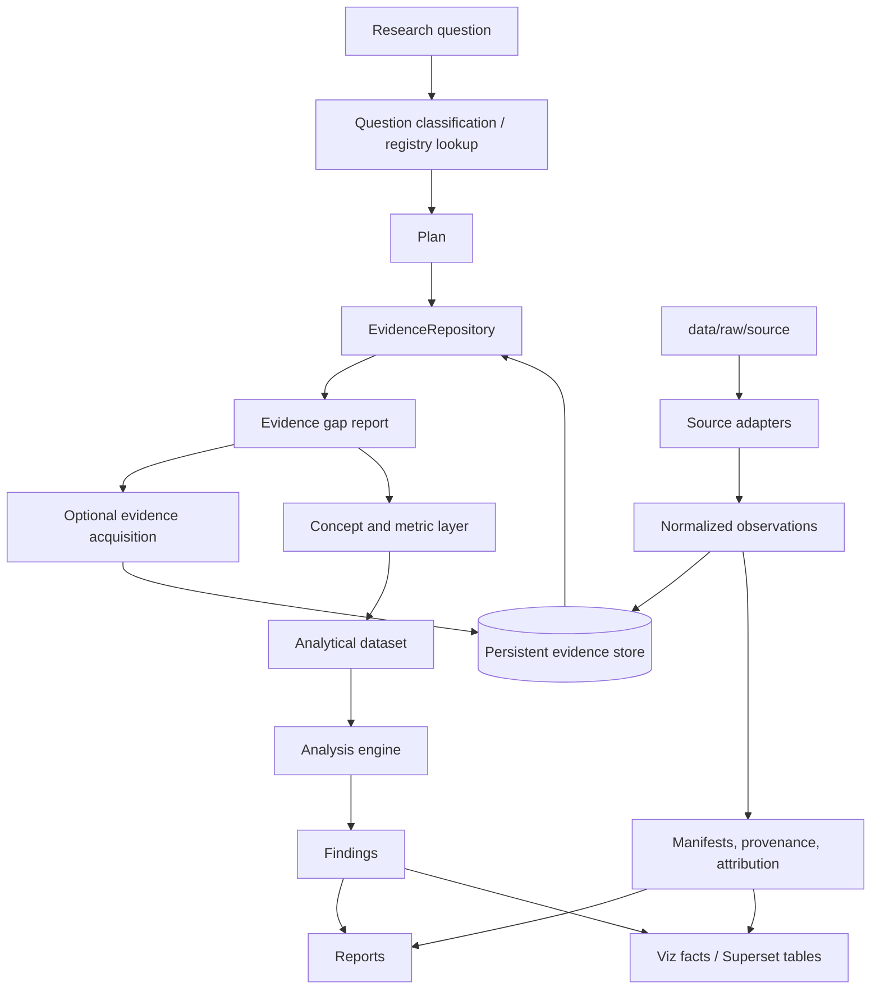

# Architecture — Research Engine

## Purpose

The research engine turns reusable source evidence into analytical datasets,
findings, reports, and visualization tables.

For implementation-level contracts, object shapes, artifact layouts, and test
surfaces, see
[`research-engine-implementation.md`](research-engine-implementation.md).

It extends the current leader-validation prototype without replacing the core
rules: raw data stays local, source provenance is preserved, client data remains
validation-only, and every public output carries attribution.

The core evidence unit is intentionally simple: a normalized database row with
generic scope dimensions, an indicator key, a value, source metadata, and
provenance. Answers and findings point to evidence row ids; evidence rows point
to original files, API records, URLs, quotes, or document locators.

## Target ruler-quality execution topology

Ruler-quality external research is organized by ruler-period, while judgment is
organized by chapter-year:

```text
~190 resolved ruler-period researcher sessions
  -> one reusable evidence dossier per ruler
  -> cited evidence associated with the 80 chapter lenses

8 chapter-year judge sessions
  -> one judge consumes all ten lenses for one chapter across all rulers
  -> one chapter guide and comparison meter across the whole ruler batch
  -> one persisted chapter score per ruler/chapter/year
```

The target workload is therefore approximately `rulers + 8 chapters` core model
runs, not `rulers × questions`. A source item is collected once and may inform
several lenses or chapters. Evidence researchers do not assign final comparative
scores. They preserve citations, contrary evidence, period fit, attribution, and
likely lens relevance. Chapter judges reason from the evidence itself, apply one
guide across the ruler batch, and synthesize ten overlapping lenses into one
score rather than mechanically averaging ten question scores.

Coverage labels, evidence-ID ordering, and mapping relations are advisory LLM
handoff metadata. The parent normalizes harmless inconsistencies and records
warnings. Missing lenses reduce confidence or trigger targeted follow-up; they do
not invalidate the dossier or automatically lower the chapter score. Identity,
citation provenance, ruler/period scope, and non-invention remain strict.

A researcher session may run for as long as needed and may use a low-cost model,
but durability must not depend on model memory or one final response. It must
checkpoint discovered sources, normalized evidence records, question mappings,
coverage gaps, and progress throughout the run so an interrupted session can
resume without repeating discovery. Retries, quarantined identities, and manual
review are operational exceptions, not additional primary execution units.

The tracked Codex role contracts live at
`.agents/skills/ruler-evidence-researcher/` and
`.agents/skills/ruler-chapter-judge/`. Model selection remains outside those
skills so the same role can run through different configured providers. The
versioned candidates in `configs/research-models.yaml` currently include the
locally configured MiniMax M2.7 low-cost researcher candidate, MiniMax M3
long-context researcher/judge candidate, and the active Codex session default.
No cost class is treated as a quality guarantee.

Before launch, run `leaders-db research readiness`. Dossier mode may select a
pilot subset with repeated `--question-id`; omitting it checks the full 80-lens
target. Chapter-judge mode requires exactly one `--chapter-id`. The preflight is non-mutating
and fails closed on missing tables, guides, judge rubrics, role skills, model-role
support, provider configuration/credential presence, unsafe output reuse, or no
eligible identities. Unresolved identities are counted and quarantined rather
than making an otherwise usable year fail globally.

Long-running execution uses the durable ledger introduced by migration 0006.
One run key owns its dossier and judge jobs. Workers claim jobs through an atomic
lease, persist checkpoints throughout evidence collection, renew heartbeats, and
complete or fail through guarded transitions. Expired work can be reclaimed with
its checkpoint intact; each claim has a fencing token that prevents a stale
process from writing after expiry or reassignment. A judge and all of its
dependency edges are created in one transaction, and the job cannot be claimed
partially planned. A judge job carries dependency edges to the eligible
dossiers for its question and cannot be claimed early. Provider selection is
persisted on every job, allowing MiniMax, OpenAI Luna/Terra, and other configured
candidates to be compared without changing role contracts.

The dossier worker uses a persistent researcher thread, evidence-review loop, and
separate formatter. The initial phase invokes the exact persisted researcher model
(including the configured named profile layer
for non-OpenAI providers) without an output schema. It records references, main
points, caveats, period/ruler fit, contrary material, and chapter/lens relevance
in a permissive notebook and handoff. After every selected chapter passes evidence
review or reaches a documented blocker, the separately persisted formatter profile
(Luna by CLI default) receives the strict dossier schema and performs no new
research. Researcher and formatter usage are priced separately and then summed,
so mixed-provider runs retain correct attribution. The repository sandbox is
read-only; only the job-specific output directory is added as writable for
approved artifacts. The parent owns the schema, heartbeat, fencing token, final
validation, atomic publication, and ledger completion. Neither model receives
the lease token.

Before research starts, the parent builds `local_structured_prior_v2` artifacts for
every selected lens. The trusted `local-priors.json` retains all question-level
statuses and source provenance. Prompt construction transforms it into
`ruler_local_prior_package_v1`: identical country-year facts are stored once with
stable local fact IDs, source observation IDs, valid local-prior locators, mapping
notes, candidate lens links, and per-methodology dispositions whose repeated reason
and instruction text is stored once. Both researcher and formatter receive this compact
package rather than eighty repeated fact arrays. The researcher must audit it before
internet discovery and may not interpret a missing row as a zero/favorable result.
An `error` disposition is a blocking local-input failure, so web evidence cannot
silently conceal a broken extraction.

Notebook-mode production jobs use this attempt-scoped phase sequence:

```text
initial local-first, chapter-sequential direct-search researcher
  <-> no-search/no-score evidence reviewer of every chapter
      and resume <exact-thread-id> for identified gaps (up to three rounds)
  -> low-cost strict formatter
  -> validated dossier publication
  -> one no-search chapter judge per chapter/year batch
  -> score/order audit across the completed comparative judgments
```

`--last` is forbidden because ruler workers may execute concurrently. Batch membership
is frozen in a hash-verified ruler-year manifest. Comparative judges receive immutable
chapter projections rather than full 80-lens dossiers; the parent reserves output
context and blocks a projected batch that exceeds the model's declared window.

After the research pass, the worker writes a checkpoint containing the notebook
and event-log SHA-256 values in a non-writable trusted sibling directory. It
revalidates both digests before publication, and the final dossier records the
notebook path and hash. If formatting fails, a retry verifies and reuses the
completed notebook, then reruns only the formatter.

The active workflow uses one persistent researcher thread per ruler-period. It
loads local facts first, then works through chapters 1B–8B in order and searches
the internet directly until each chapter is reasonably saturated or blocked. A
no-search evidence reviewer inspects every chapter and may return any deficient
chapters to the same thread for up to three rounds. The reviewer never scores or
repairs serialization. A separate no-search formatter converts the final flexible
notebook into the validated dossier.

Each claim writes into a lease-token-scoped attempt directory, so an expired
worker cannot corrupt a reclaimed attempt. The normal target is 5–20 defensible
source-claim units per chapter, with ten as a planning center rather than a ceiling
or automatic acceptance rule. A unit is one traceable source supporting one
materially distinct claim; empty priors, equivalent URLs, and excerpt/heading
splits do not increase the count. Chapter mappings and independent locator/source
families are reported separately. Evidence depth responds to source abundance: a
prominent contemporary ruler normally demands substantially more searching and
corroboration than an obscure historical case, while genuine sparse-case shortfalls
are documented rather than padded.
Publication renews and verifies the lease immediately before atomic promotion;
a failed fenced checkpoint orphans the attempt artifact rather than blocking a
retry.

## One-line architecture

```text
research question
  -> registered or LLM-assisted question classification
  -> investigation plan
  -> evidence repository query
  -> evidence gap report
  -> optional targeted evidence acquisition
  -> concept / metric extraction
  -> analytical dataset
  -> analysis + findings
  -> reports + Superset-ready tables
```

## System diagram



## Layers

### 1. Source layer

Owned by `leaders_db.sources`.

Responsibility:

- read raw source material;
- emit `NormalizedObservation` records;
- preserve raw locators, source version, warnings, and attribution;
- never silently fill missing data.

Already started:

- `SourceAdapter` protocol;
- `SourceIngestRequest`;
- `NormalizedObservation`;
- `SourceIngestRunner`;
- clean adapters under `src/leaders_db/sources/adapters/`.

Target lifecycle:

```text
check_ready -> read_raw -> transform -> validate -> persist -> manifest
```

### 2. Persistent evidence repository

The evidence repository is the reusable read boundary over ingested evidence.

Adapters write observations once. Research, scoring, reporting, and viz read them
many times.

Current implementation:

- `InMemoryEvidenceRepository` for tests and slices.
- `SqlEvidenceRepository` backed by SQLite for persisted normalized observations
  in `normalized_observations`.

Future implementation:

- PostgreSQL deployment hardening for the same repository boundary.

The query API remains:

```python
EvidenceQuery(
    source_ids=(SourceId("maddison_project"),),
    observation_families=("economic_country_year",),
    indicator_codes=("gdppc", "pop"),
    scope_filter=ScopeFilter(filters=(
        DimensionFilter(key="country", values=("SWE",), role="entity"),
        DimensionFilter(key="year", values=(1962,), role="time"),
    )),
)
```

### 3. Concept and metric layer

This layer translates source-native indicators into stable analytical meaning.

Examples:

- `gdppc` + `pop` from Maddison -> `gdp_total`;
- WDI GDP current USD -> `gdp_total_nominal_usd`;
- PWT output/population -> `gdp_per_capita`.

Distinction:

| Layer | Meaning |
|---|---|
| Observation | A normalized source fact, stored once. |
| Concept | A source-independent semantic variable, e.g. `gdp_total`. |
| Metric | A chart/report-ready definition with unit, grain, aggregation, transforms, and policy. |

Current implementation:

- `leaders_db.sources.concepts`;
- `leaders_db.viz.metrics`;
- `leaders_db.viz.concept_bridge`, the explicit bridge from stable source
  concepts (`gdp_per_capita`, `population`, `gdp_total`) to chart/report-ready
  metrics (`concept.gdp_per_capita`, `concept.population`, `concept.gdp_total`).

The first bridge policy is explicit: source diagnostics and precedence use
`world_bank_wdi -> maddison_project -> pwt` unless callers provide a narrower
`source_ids` request. Missing requested/precedence sources still produce coverage
diagnostics with zero observation/concept rows so absence is visible instead of
silently omitted.

### 4. Research engine layer

This is the new orchestration layer.

It answers:

- what is the question asking?
- what concepts and metrics are needed?
- which generic scope dimensions and sources are in scope?
- what table should be built?
- what analyses should be run?
- what findings and artifacts should be produced?

Proposed package:

```text
src/leaders_db/research/
├── questions.py
├── planner.py
├── dataset_builder.py
├── analysis.py
├── findings.py
├── runner.py
└── artifacts.py
```

Core objects:

```python
ResearchQuestion
InvestigationPlan
AnalyticalDataset
AnalysisResult
Finding
ResearchRunResult
```

### 5. Analysis engine

The analysis engine computes reusable analytical operations over an analytical
dataset.

Initial operations:

- trend over time;
- CAGR / growth rate;
- ranking by year;
- before/after comparison;
- source coverage and missingness;
- source disagreement;
- outlier detection.

Later operations:

- cohort comparison;
- correlation exploration;
- confidence-weighted aggregation;
- event-window analysis.

### 6. Reporting layer

The reporting layer turns structured findings into human-readable outputs.

Outputs:

- Markdown report;
- HTML report;
- CSV appendix;
- JSON findings;
- chart-ready CSV;
- Superset table registration.

Every report must include:

- question;
- scope;
- methods;
- findings;
- caveats;
- missingness;
- confidence;
- source attribution.

### 7. Visualization layer

Superset is a read-only presentation surface.

It consumes prepared tables from `leaders_db.viz` and research-run artifacts. It
must not own source precedence, scoring, confidence, or official metric logic.

Existing base:

- `viz_country_year_metrics`;
- `viz_metric_catalog`;
- Superset SQLite builder;
- local Superset deployment;
- investigation-slice output table.

## Example flow: Sweden GDP in 1962

Question:

```text
What was Sweden's GDP in 1962?
```

Plan:

```python
InvestigationPlan(
    concepts=("gdp_total",),
    scope_filter=ScopeFilter(filters=(
        DimensionFilter(key="country", values=("SWE",), role="entity"),
        DimensionFilter(key="year", values=(1962,), role="time"),
    )),
    preferred_sources=("maddison_project", "pwt", "world_bank_wdi"),
    analyses=("point_lookup", "coverage"),
)
```

Evidence query:

```python
EvidenceQuery(
    observation_families=("economic_country_year",),
    scope_filter=ScopeFilter(filters=(
        DimensionFilter(key="country", values=("SWE",), role="entity"),
        DimensionFilter(key="year", values=(1962,), role="time"),
    )),
)
```

Concept extraction:

```text
Maddison gdppc + Maddison pop -> gdp_total
```

Answer row:

```text
row_scope_json: {"country":"SWE","year":1962}
concept: gdp_total
value: <derived value>
unit: <source-compatible GDP unit>
source: maddison_project
provenance: input observation ids + raw locators
caveat: historical estimate, unit-specific
```

## Example flow: GDP table for all countries, 1900-2026

Question:

```text
Create a GDP table for all countries between 1900 and 2026.
```

The source observations are not recreated per question. They are reused from the
persistent evidence store.

The research run creates a derived artifact:

```text
data/outputs/research/<run-id>/analytical-dataset.csv
```

Expected row grain:

```text
scope_json, concept, value, unit, source, coverage_status
```

For `leaders-db` convenience outputs, `scope_json` may also be flattened into
columns such as `country`, `year`, `ruler`, or `category`.

Rows for unavailable years remain explicit missing rows or coverage rows. The
engine must not silently project 2024 data into 2026. These explicit missing
rows are analytical/coverage artifacts for the research run; they are not stored
as source observations.

## Persistence model

Short term:

- keep existing 11-table schema;
- add source-run artifacts under `data/processed/<source>/` and
  `data/outputs/research/<run-id>/`;
- add `SqlEvidenceRepository` over a new normalized-observation table or a
  compatibility view.

Recommended new table:

```text
normalized_observations
```

This table would be the persistent implementation detail behind
`EvidenceRepository`. It must either remain compatible with the existing
`source_observations` provenance trail or become its reviewed replacement in a
future schema migration.

Minimum columns:

```text
source_slug
observation_id
observation_family
indicator_code
scope_json
value_json
value_type
unit
scale
source_version
raw_locator_json
transform_locator_json
quality_flags_json
warnings_json
extension_json
run_id
created_at
```

Project-specific dimensions such as country, year, ruler, category, event, or
source are stored inside `scope_json` for the generic research engine. Convenience
views may flatten common dimensions for `leaders-db` and Superset.

Research-run artifacts may start as files, then move into tables if needed:

```text
research_questions
investigation_runs
analytical_datasets
findings
report_artifacts
```

## Boundaries and invariants

- Source adapters do not answer research questions.
- Research code does not read raw files directly.
- Superset does not define official metrics.
- Client matrix data is validation-only.
- Missing data is explicit.
- Every public output carries attribution.
- Every finding links back to source observations or states why evidence is
  insufficient.
